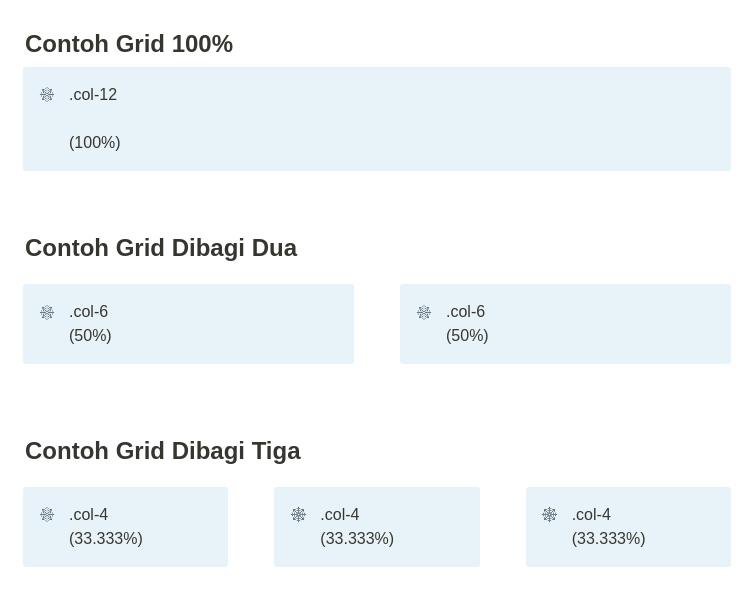
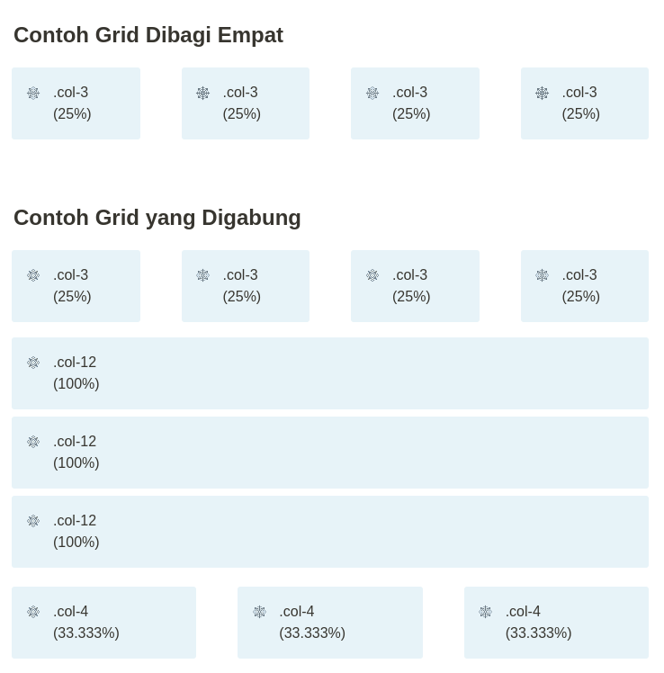

# Part 1 — Berkenalan dengan Bootstrap

# Overview

Jika kamu sudah mempelajari materi [Belajar basic HTML](../basic-html/1-introduction.md) tentu kamu sudah mempelajari basic CSS. Apa yang kamu rasakan setelah mempelajari basic CSS? Menyenangkan? Kesal? Hal yang biasa, terutama bagi para backend developer.

Bagi backend developer, membuat sebuah web yang ciamik sangatlah menyebalkan, hal ini dikarenakan ya CSS memang menyebalkan. Terutama jokes yang hingga saat ini masih terngiang bagi para backend developer, ialah jokes mengenai cara membuat elemen div menjadi posisi center, dan mengukur ukuran margin/padding dengan penggaris.

Pada materi ini, saya akan membuatkan sebuah pengenalan dengan bootstrap khususnya bagi para backend developer atau kamu yang baru saja masuk ke dalam dunia programming agar mudah memahami dan membuat sebuah website menggunakan bootstrap.

> [!NOTE]
> 💡 Materi tidak akan kompleks, namun cukup untuk pengetahuan dasar. Apabila kamu ingin materi yang lebih kompleks kamu dapat membaca dokumentasi lengkapnya pada

# Boostrap

> [!NOTE]
> 💡 Bootstrap adalah sebuah framework CSS yang membuat development web menjadi lebih cepat dan responsif dengan komponen yang tersedia.


Dengan bootstrap, kamu dapat membuat web yang responsif dan memiliki struktur yang lebih baik ketimbang kamu harus menulis dari enol untuk membuat CSS-nya.

Kapan harus menggunakan bootstrap?

1. Saat kita punya gambaran/wireframe tapi tidak memiliki desain UI-nya.
2. Saat kita ingin mengerjakan sebuah web agar lebih cepat dan tidak membuang waktu untuk membuatnya dari 0.

# Instalasi

Boostrap bisa didownload dan dimasukan sebagai file local, tapi akan lebih mudah apabila kita menggunakan URL CDN saja.

> [!NOTE]
> 💡 URL CDN adalah URL tempat CSS dan Javascript untuk Bootstrap disimpan

```jsx
<link href="https://cdn.jsdelivr.net/npm/bootstrap@5.1.0/dist/css/bootstrap.min.css" rel="stylesheet" integrity="sha384-KyZXEAg3QhqLMpG8r+8fhAXLRk2vvoC2f3B09zVXn8CA5QIVfZOJ3BCsw2P0p/We" crossorigin="anonymous">
<script src="https://cdn.jsdelivr.net/npm/bootstrap@5.1.0/dist/js/bootstrap.bundle.min.js" integrity="sha384-U1DAWAznBHeqEIlVSCgzq+c9gqGAJn5c/t99JyeKa9xxaYpSvHU5awsuZVVFIhvj" crossorigin="anonymous"></script>
```

Dengan menuliskan ini pada HTML, kita dapat dengan mudah menggunakan Bootstrap.

> [!NOTE]
> 💡 Sebenarnya ada banyak metode dalam instalasi Bootstrpa, seperti menggunakan NPM, Yarn, atau package manager lainnya. Namun karena kita hanya ingin mempelajarinya secara singkat dan tidak menyeluruh, maka menggunakan CDN adalah pilihan yang tepat.

# Konsep Grid

Untuk menggunakan Boostrap, kamu harus memahami konsep grid di bootstrap terlebih dahulu. Pada [tutorial ini](../basic-html/4-responsive-web.md) saya pernah menjelaskan tentang konsep 100% width pada page, serta konsep col-12 yang sudah saya jelaskan.

Bootstrap juga seperti itu, kita menggunakan grid dengan maksimal angka 12 untuk membuat tata letak baris pada elemen HTML kita.





> [!NOTE]
> 💡 Ingat selalu konsep grid pada bootstrap memiliki lebar maksimal 12. Kamu harus memaksimalkan tiap grid dengan penjumlahan sebesar 12. Misalnya 4+8, 7+5, 5+7 atau penjumlahan apapun yang hasilnya 12. Hal ini dilakukan agar grid dapat maksimal sehingga tata letak elemen kamu menjadi lebih rapih.

# Template Starter Bootstrap

Cobalah copy paste kode berikut pada editor favorit kalian, dan coba jalankan file HTMLnya.

```jsx
<!doctype html>
<html lang="en">

<head>
    <!-- Required meta tags -->
    <meta charset="utf-8">
    <meta name="viewport" content="width=device-width, initial-scale=1">

    <!-- Bootstrap CSS -->
    <link href="https://cdn.jsdelivr.net/npm/bootstrap@5.1.0/dist/css/bootstrap.min.css" rel="stylesheet" integrity="sha384-KyZXEAg3QhqLMpG8r+8fhAXLRk2vvoC2f3B09zVXn8CA5QIVfZOJ3BCsw2P0p/We" crossorigin="anonymous">

    <title>Hello, world!</title>
</head>

<body>
    <h1>Hello, world!</h1>

    <script src="https://cdn.jsdelivr.net/npm/bootstrap@5.1.0/dist/js/bootstrap.bundle.min.js" integrity="sha384-U1DAWAznBHeqEIlVSCgzq+c9gqGAJn5c/t99JyeKa9xxaYpSvHU5awsuZVVFIhvj" crossorigin="anonymous"></script>
</body>

</html>
```

Selamat, kamu baru saja berkenalan dengan Bootstrap!

Untuk dokumentasi lengkapnya kamu dapat menemukannya disini ya!

[Introduction](https://getbootstrap.com/docs/5.1/getting-started/introduction/)