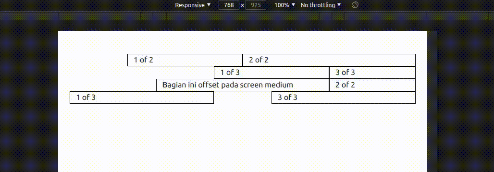
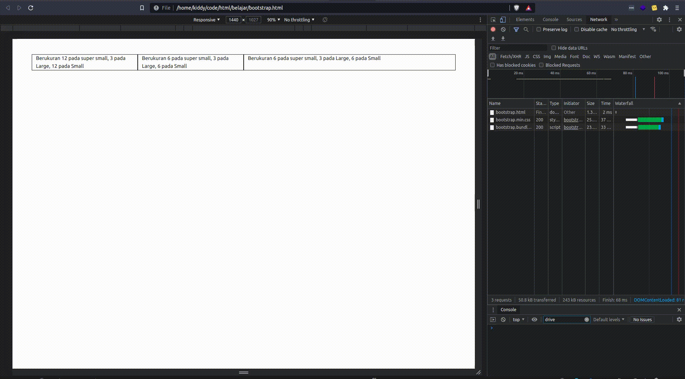

# Part 2 — Berkenalan dengan Layout

# Overview

Setelah berkenalan dengan bootstrap, kita akan belajar mengenai layouting pada bootstrap yang terdiri dari breakpoints, grid, serta columns.

# Breakpoints

## Konsep Dasar

- **Breakpoints adalah blok bangunan dari desain yang responsif**. Menggunakan breakpoints akan membantu kamu dalam mengendalikan tampilan yang dapat diadaptasi pada beberapa ukuran layar perangkat.
- **Menggunakan media queries untuk mempermudah arsitektur CSS dengan breakpoint**. Pada CSS terdapat media queries yang dapat membantu kamu mengganti CSS pada ukuran layar tertentu. Breakpoints pada bootstrap sudah mengatur hal tersebut, sehingga kamu tidak perlu repot lagi menggunakan media queries.
- **Mobile first, goal dari breakpoints adalah desain yang responsif.**  Bootstrap memiliki tujuan untuk membuat tampilan minimalis dengan breakpoint paling kecil, yaitu mobile.

<br />

|Breakpoint|Class infix|Dimensions|
|-|-|-|
|X-Small|None|< 576px|
|Small|sm|≥ 576px|
|Medium|md|≥ 768px|
|Large|lg|≥ 992px|
|Extra Large|xl|≥ 1200px|
|Extra extra Large|xxl|≥ 1400px|


# Containers

Containers merupakan class untuk membuat website kamu layaknya wadah. Apa yang dimaksud dengan wadah? Yaitu sebuah class yang akan mengatur secara otomatis tata letak elemen kamu menjadi memiliki jarak antara viewport kanan dan krii. Agar lebih detail silahkan copy code berikut:

```html
<!doctype html>
<html lang="en">

<head>
    <!-- Required meta tags -->
    <meta charset="utf-8">
    <meta name="viewport" content="width=device-width, initial-scale=1">

    <!-- Bootstrap CSS -->
    <link href="https://cdn.jsdelivr.net/npm/bootstrap@5.1.0/dist/css/bootstrap.min.css" rel="stylesheet" integrity="sha384-KyZXEAg3QhqLMpG8r+8fhAXLRk2vvoC2f3B09zVXn8CA5QIVfZOJ3BCsw2P0p/We" crossorigin="anonymous">

    <title>Hello, world!</title>
</head>

<body>
    <div class="container">
        <h1>Hello, world!</h1>
    </div>

    <script src="https://cdn.jsdelivr.net/npm/bootstrap@5.1.0/dist/js/bootstrap.bundle.min.js" integrity="sha384-U1DAWAznBHeqEIlVSCgzq+c9gqGAJn5c/t99JyeKa9xxaYpSvHU5awsuZVVFIhvj" crossorigin="anonymous"></script>
</body>

</html>
```

Sekarang cobalah hapus class container pada div, dan lihat sendiri hasilnya.

> [!NOTE]
> 💡 Terasa sekali perbedaannya bukan? Gunakanlah container untuk mempermudah kamu dalam membuat konten website.

# Grid (Row)

Grid (Row) adalah sebuah baris pada bootstrap. Gunanya yaitu agar kamu dapat dengan mudah membuat sebuah baris dengan konten yang sudah lurus secara horizontal. Agar dapat lebih mudah cobalah code berikut:

```html
<!doctype html>
<html lang="en">

<head>
    <!-- Required meta tags -->
    <meta charset="utf-8">
    <meta name="viewport" content="width=device-width, initial-scale=1">

    <!-- Bootstrap CSS -->
    <link href="https://cdn.jsdelivr.net/npm/bootstrap@5.1.0/dist/css/bootstrap.min.css" rel="stylesheet" integrity="sha384-KyZXEAg3QhqLMpG8r+8fhAXLRk2vvoC2f3B09zVXn8CA5QIVfZOJ3BCsw2P0p/We" crossorigin="anonymous">

    <title>Hello, world!</title>

    <style>
        .line-outside {
            border: 1px solid #000;
        }
    </style>
</head>

<body>
    <div class="container mt-5">
        <div class="row">
            <div class="col line-outside">
                1 of 2
            </div>
            <div class="col line-outside">
                2 of 2
            </div>
        </div>
        <div class="row">
            <div class="col line-outside">
                1 of 3
            </div>
            <div class="col line-outside">
                2 of 3
            </div>
            <div class="col line-outside">
                3 of 3
            </div>
        </div>
    </div>

    <script src="https://cdn.jsdelivr.net/npm/bootstrap@5.1.0/dist/js/bootstrap.bundle.min.js" integrity="sha384-U1DAWAznBHeqEIlVSCgzq+c9gqGAJn5c/t99JyeKa9xxaYpSvHU5awsuZVVFIhvj" crossorigin="anonymous"></script>
</body>

</html>
```

<br />

> [!NOTE]
> 💡 Cobalah hapus class row, dan lihat perbedaannya 😄

<br />

# Columns

Kolom bekerja pada bagian isi dari baris. Kamu memerlukan kolom untuk dapat digunakan sebagai pembagi sebuah konten. Seperti lebar breakpoints yang sudah saya jelaskan di atas, hal ini dapat di-implementasikan pada sebuah kolom. 

<br />

## Cara kolom bekerja

- **Kolom dibangun pada flexbox grid**. Flexbox berarti kita dapat dengan mudah mengganti kolom individual dan memodifikasi kolom grup pada level grid.
- **Ketika menggunakan grid, maka semua isinya haruslah sebuah kolom.** Hierarki pada Bootstrap grid berasal dari container → row (grid) → kolom → konten. Pada beberapa kasus kamu dapat menggabungkan antara konten dengan kolom, tapi perlu pengetahuan lebih lanjut agar tidak membuat kontenmu berantakan.

<br />

> [!NOTE]
> 💡 Kolom pada bootstrap dibagi hingga maksimal yaitu 12.

<br />

Untuk dapat mencobanya, cobalah tulis kode berikut:

```html
<!doctype html>
<html lang="en">

<head>
    <!-- Required meta tags -->
    <meta charset="utf-8">
    <meta name="viewport" content="width=device-width, initial-scale=1">

    <!-- Bootstrap CSS -->
    <link href="https://cdn.jsdelivr.net/npm/bootstrap@5.1.0/dist/css/bootstrap.min.css" rel="stylesheet" integrity="sha384-KyZXEAg3QhqLMpG8r+8fhAXLRk2vvoC2f3B09zVXn8CA5QIVfZOJ3BCsw2P0p/We" crossorigin="anonymous">

    <title>Hello, world!</title>

    <style>
        .line-outside {
            border: 1px solid #000;
        }
    </style>
</head>

<body>
    <div class="container mt-5">
        <div class="row">
            <div class="col-4 line-outside">
                1 of 2
            </div>
            <div class="col-8 line-outside">
                2 of 2
            </div>
        </div>
        <div class="row">
            <div class="col-4 line-outside">
                1 of 3
            </div>
            <div class="col-5 line-outside">
                2 of 3
            </div>
            <div class="col-3 line-outside">
                3 of 3
            </div>
        </div>
        <div class="row">
            <div class="col-6 line-outside">
                1 of 3
            </div>
            <div class="col-6 line-outside">
                2 of 2
            </div>
        </div>

        <div class="row">
            <div class="col-5 line-outside">
                1 of 3
            </div>
            <div class="col-2 line-outside">
                2 of 3
            </div>
            <div class="col-5 line-outside">
                3 of 3
            </div>
        </div>
    </div>

    <script src="https://cdn.jsdelivr.net/npm/bootstrap@5.1.0/dist/js/bootstrap.bundle.min.js" integrity="sha384-U1DAWAznBHeqEIlVSCgzq+c9gqGAJn5c/t99JyeKa9xxaYpSvHU5awsuZVVFIhvj" crossorigin="anonymous"></script>
</body>

</html>
```

> [!NOTE]
> 💡 Gunakan kombinasi angka hingga berjumlah 12 agar dapat memaksimalkan ukuran layar horizontal.

## Kolom dengan offset

Kolom yang tidak terpenuhi atau kosong dapat diisi dengan sebuah offset, offset akan memenuhi ruang kosong yang harusnya diisi oleh sebuah elemen. Biasanya offset digunakan agar kamu dapat memberikan jarak dari sebelah kiri.

Cobalah kode berikut:

```html
<!doctype html>
<html lang="en">

<head>
    <!-- Required meta tags -->
    <meta charset="utf-8">
    <meta name="viewport" content="width=device-width, initial-scale=1">

    <!-- Bootstrap CSS -->
    <link href="https://cdn.jsdelivr.net/npm/bootstrap@5.1.0/dist/css/bootstrap.min.css" rel="stylesheet" integrity="sha384-KyZXEAg3QhqLMpG8r+8fhAXLRk2vvoC2f3B09zVXn8CA5QIVfZOJ3BCsw2P0p/We" crossorigin="anonymous">

    <title>Hello, world!</title>

    <style>
        .line-outside {
            border: 1px solid #000;
        }
    </style>
</head>

<body>
    <div class="container mt-5">
        <div class="row">
            <div class="col-4 offset-2 line-outside">
                1 of 2
            </div>
            <div class="col-6 line-outside">
                2 of 2
            </div>
        </div>
        <div class="row">
            <div class="col-4 offset-5 line-outside">
                1 of 2
            </div>
            <div class="col-3 line-outside">
                2 of 2
            </div>
        </div>
        <div class="row">
            <div class="col-6 offset-md-3 line-outside">
                Bagian ini offset pada screen medium
            </div>
            <div class="col-md-3 col-12 line-outside">
                2 of 2
            </div>
        </div>

        <div class="row">
            <div class="col-5 line-outside">
                1 of 2
            </div>
            <div class="col-5 offset-2 line-outside">
                2 of 2
            </div>
        </div>
    </div>

    <script src="https://cdn.jsdelivr.net/npm/bootstrap@5.1.0/dist/js/bootstrap.bundle.min.js" integrity="sha384-U1DAWAznBHeqEIlVSCgzq+c9gqGAJn5c/t99JyeKa9xxaYpSvHU5awsuZVVFIhvj" crossorigin="anonymous"></script>
</body>

</html>
```

## Hasil



Offset memberikan jarak pada sebuah kolom sehingga dapat digeser dari sebelah kiri layaknya padding. Bedanya offset mengisi ruang kosong tersebut.

```html
<div class="col-6 offset-md-3 line-outside">
	Bagian ini offset pada screen medium
</div>
<div class="col-md-3 col-12 line-outside">
	2 of 2
</div>
```

Perhatikan kode di atas, disini terdapat settingan offset berbeda, yaitu offset baru aktif ketika screen pada layar dengan lebar medium (minimal 768px). Sehingga dapat dilihat ketika screennya medium, elemen "bagian ini offset pada screen medium" jadi tergeser sebanyak 3 kolom.

<aside>
💡 Ingat rumus bahwa offset + col mempengaruhi aturan 12 grid rules.

Contoh: 

(Offset 3 + col 6) + col-3
3 + 6 + 3 = **12**

</aside>

## Latihan

Tulislah kode berikut dan perhatikan hasilnya.

```html
<!doctype html>
<html lang="en">

<head>
    <!-- Required meta tags -->
    <meta charset="utf-8">
    <meta name="viewport" content="width=device-width, initial-scale=1">

    <!-- Bootstrap CSS -->
    <link href="https://cdn.jsdelivr.net/npm/bootstrap@5.1.0/dist/css/bootstrap.min.css" rel="stylesheet" integrity="sha384-KyZXEAg3QhqLMpG8r+8fhAXLRk2vvoC2f3B09zVXn8CA5QIVfZOJ3BCsw2P0p/We" crossorigin="anonymous">

    <title>Hello, world!</title>

    <style>
        .line-outside {
            border: 1px solid #000;
        }
    </style>
</head>

<body>
    <div class="container mt-5">
        <div class="row">
            <div class="col-12 col-lg-3 col-sm-12 line-outside">
                Berukuran 12 pada super small, 3 pada Large, 12 pada Small
            </div>
            <div class="col-6 col-lg-3 col-sm-6 line-outside">
                Berukuran 6 pada super small, 3 pada Large, 6 pada Small
            </div>
            <div class="col-6 col-lg-6 col-sm-6 line-outside">
                Berukuran 6 pada super small, 3 pada Large, 6 pada Small
            </div>
        </div>
    </div>

    <script src="https://cdn.jsdelivr.net/npm/bootstrap@5.1.0/dist/js/bootstrap.bundle.min.js" integrity="sha384-U1DAWAznBHeqEIlVSCgzq+c9gqGAJn5c/t99JyeKa9xxaYpSvHU5awsuZVVFIhvj" crossorigin="anonymous"></script>
</body>

</html>
```

> [!NOTE]
> 💡 Ujicoba responsif dengan cara menggunakan device pada browser. Kamu dapat melakukannya dengan cara klik kanan → Inspect Element atau menekan tombol keyboard CTRL + SHIFT + I

## Hasil



Mudah sekali bukan menggunakan Bootstrap? 🙂 Untuk dokumentasi lengkapnya kamu dapat menemukannya disini ya!
