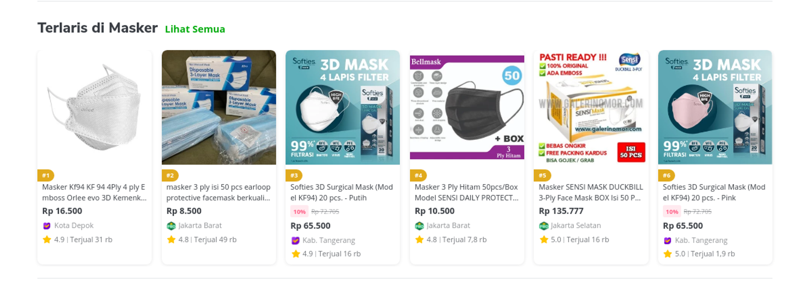
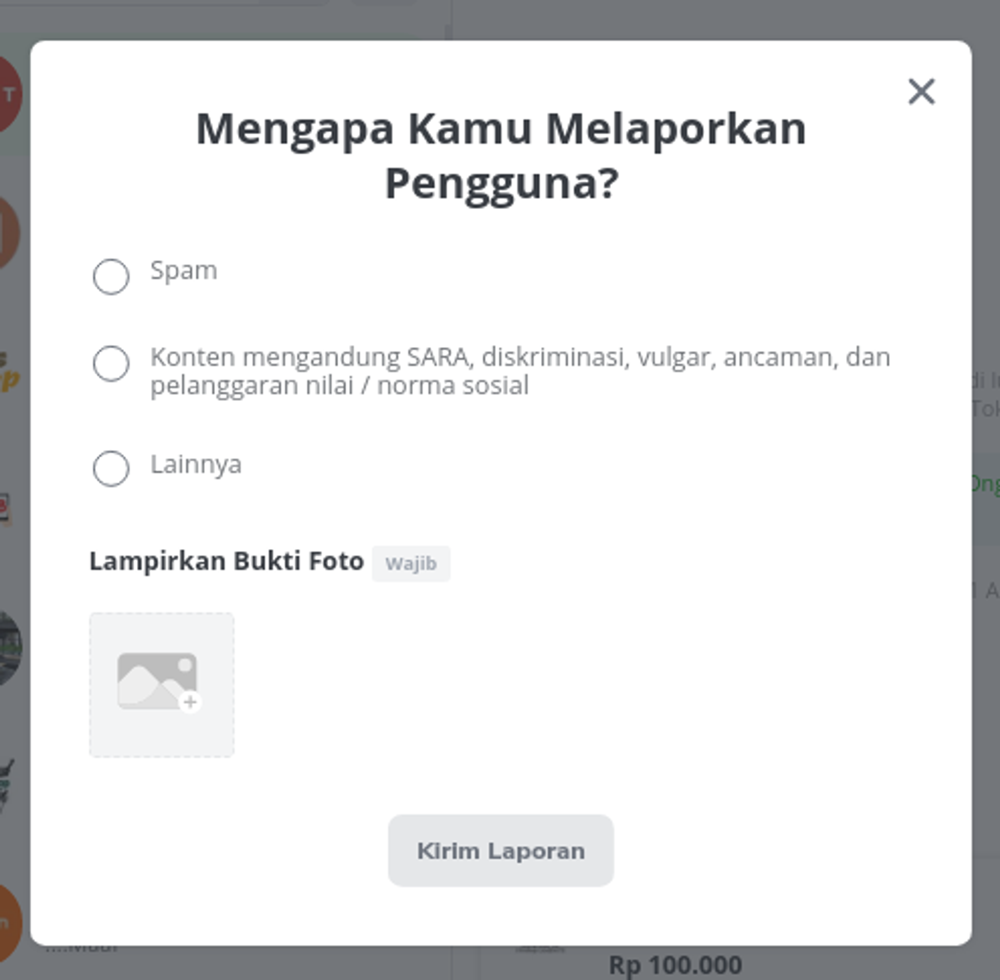

# Part 3 — Berkenalan dengan Komponen

# Overview

Setelah kita belajar mengenai instalasi, pengenalan, dan konsep layout pada Bootstrap, sekarang kita akan mempelajari mengenai komponen di Bootstrap.

Bootstrap terdiri dari banyak sekali komponen, saking banyaknya komponen tidak bisa saya jabarkan satu persatu, untuk melihat komponen lengkap bootstrap kamu dapat mengunjungi dokumentasi Bootstrap:

[Accordion](https://getbootstrap.com/docs/5.1/components)

> [!NOTE]
> 💡 Materi ini hanya akan memberikan komponen dasar yang paling sering digunakan pada Bootstrap.

# Base Code

Untuk mengerjakan materi ini, kamu dapat menggunakan base code berikut (sama saja seperti part 2):

```html
<!doctype html>
<html lang="en">

<head>
    <!-- Required meta tags -->
    <meta charset="utf-8">
    <meta name="viewport" content="width=device-width, initial-scale=1">

    <!-- Bootstrap CSS -->
    <link href="https://cdn.jsdelivr.net/npm/bootstrap@5.1.0/dist/css/bootstrap.min.css" rel="stylesheet" integrity="sha384-KyZXEAg3QhqLMpG8r+8fhAXLRk2vvoC2f3B09zVXn8CA5QIVfZOJ3BCsw2P0p/We" crossorigin="anonymous">

    <title>Hello, world!</title>

    <style>
        .line-outside {
            border: 1px solid #000;
        }
    </style>
</head>

<body>
    <div class="container mt-5">
        <div class="row">
            <div class="col-12 col-sm-6">
                <!-- Komponen 1-->
            </div>
            <div class="col-12 col-sm-6">
                <!-- Komponen 2-->
            </div>
        </div>
    </div>

    <script src="https://cdn.jsdelivr.net/npm/bootstrap@5.1.0/dist/js/bootstrap.bundle.min.js" integrity="sha384-U1DAWAznBHeqEIlVSCgzq+c9gqGAJn5c/t99JyeKa9xxaYpSvHU5awsuZVVFIhvj" crossorigin="anonymous"></script>
</body>

</html>
```

# Alerts

Apabila kita melakukan registrasi, kita sering melihat sebuah teks "Kamu berhasil mendaftarkan akun!" dengan warna hijau pada bagian latar. Komponen tersebut dinamakan alerts, untuk dapat menggunakannya kamu perlu menambahkan kode berikut:

```html
<div class="alert alert-{cplor class}" role="alert">
  A simple primary alert—check it out!
</div>
```

> [!NOTE]
> 💡 Bootstrap menggunakan kode warna yang sudah distrandarisasi, untuk melihat kode warna tersebut kunjungi [URL berikut](https://getbootstrap.com/docs/5.1/customize/color/).

Cobalah kode berikut:

```html
<!doctype html>
<html lang="en">

<head>
    <!-- Required meta tags -->
    <meta charset="utf-8">
    <meta name="viewport" content="width=device-width, initial-scale=1">

    <!-- Bootstrap CSS -->
    <link href="https://cdn.jsdelivr.net/npm/bootstrap@5.1.0/dist/css/bootstrap.min.css" rel="stylesheet" integrity="sha384-KyZXEAg3QhqLMpG8r+8fhAXLRk2vvoC2f3B09zVXn8CA5QIVfZOJ3BCsw2P0p/We" crossorigin="anonymous">

    <title>Hello, world!</title>

    <style>
        .line-outside {
            border: 1px solid #000;
        }
    </style>
</head>

<body>
    <div class="container mt-5">
        <div class="row">
            <div class="col-12 col-sm-6">
                <!-- Komponen 1-->
                <div class="alert alert-primary" role="alert">
                    A simple primary alert—check it out!
                </div>
                <div class="alert alert-secondary" role="alert">
                    A simple secondary alert—check it out!
                </div>
                <div class="alert alert-success" role="alert">
                    A simple success alert—check it out!
                </div>
                <div class="alert alert-danger" role="alert">
                    A simple danger alert—check it out!
                </div>
            </div>
            <div class="col-12 col-sm-6">
                <!-- Komponen 2-->
                <div class="alert alert-warning" role="alert">
                    A simple warning alert—check it out!
                </div>
                <div class="alert alert-info" role="alert">
                    A simple info alert—check it out!
                </div>
                <div class="alert alert-light" role="alert">
                    A simple light alert—check it out!
                </div>
                <div class="alert alert-dark" role="alert">
                    A simple dark alert—check it out!
                </div>
            </div>
        </div>
    </div>

    <script src="https://cdn.jsdelivr.net/npm/bootstrap@5.1.0/dist/js/bootstrap.bundle.min.js" integrity="sha384-U1DAWAznBHeqEIlVSCgzq+c9gqGAJn5c/t99JyeKa9xxaYpSvHU5awsuZVVFIhvj" crossorigin="anonymous"></script>
</body>

</html>
```

# Buttons

Membuat button yang swag pada Bootstrap sangat mudah sekali, komponen dasarnya adalah sebagai berikut:

```html
<button type="button" class="btn btn-{color class}">Primary</button>
```

Cobalah kode berikut:

```html
<!doctype html>
<html lang="en">

<head>
    <!-- Required meta tags -->
    <meta charset="utf-8">
    <meta name="viewport" content="width=device-width, initial-scale=1">

    <!-- Bootstrap CSS -->
    <link href="https://cdn.jsdelivr.net/npm/bootstrap@5.1.0/dist/css/bootstrap.min.css" rel="stylesheet" integrity="sha384-KyZXEAg3QhqLMpG8r+8fhAXLRk2vvoC2f3B09zVXn8CA5QIVfZOJ3BCsw2P0p/We" crossorigin="anonymous">

    <title>Hello, world!</title>

    <style>
        .line-outside {
            border: 1px solid #000;
        }
    </style>
</head>

<body>
    <div class="container mt-5">
        <div class="row">
            <div class="col-12">
                <!-- Komponen 1-->
                <h4>Tombol Dengan Fill Color</h4>
                <button type="button" class="btn btn-primary">Primary</button>
                <button type="button" class="btn btn-warning">Secondary</button>
            </div>
            <div class="col-12 mt-4">
                <h4>Tombol Dengan Outline Color</h4>

                <button type="button" class="btn btn-outline-success">Success</button>
                <button type="button" class="btn btn-outline-danger">Danger</button>
            </div>

        </div>
        <div class="row mt-5">
            <div class="col-12">
                <h4>Tombol Dengan Ukuran Besar</h4>
                <button type="button" class="btn btn-primary btn-lg">Large button</button>
                <button type="button" class="btn btn-secondary btn-lg">Large button</button>
            </div>
            <div class="col-12 mt-3">
                <h4>Tombol Dengan Ukuran Kecil</h4>
                <button type="button" class="btn btn-primary btn-sm">Small button</button>
                <button type="button" class="btn btn-secondary btn-sm">Small button</button>
            </div>
            <div class="col-12 mt-3">

                <h4>Tombol Dengan Keadaan Disable (tidak dapat diklik)</h4>
                <button type="button" class="btn btn-lg btn-primary" disabled>Primary button</button>
                <button type="button" class="btn btn-secondary btn-lg" disabled>Button</button>
            </div>
        </div>

        <script src="https://cdn.jsdelivr.net/npm/bootstrap@5.1.0/dist/js/bootstrap.bundle.min.js" integrity="sha384-U1DAWAznBHeqEIlVSCgzq+c9gqGAJn5c/t99JyeKa9xxaYpSvHU5awsuZVVFIhvj" crossorigin="anonymous"></script>
</body>

</html>
```

# Cards

Sering melihat gambar produk pada toko-toko online? Misalnya gambar dibawah ini.



Card Component

Ini biasa disebut dengan Cards. Bootstrap juga memiliki komponen dasar ini kok, perhatikan struktur kode komponennya:

```html
<div class="card" style="width: 18rem;">
  
  <div class="card-body">
    <h5 class="card-title">Card title</h5>
    <p class="card-text">Some quick example text to build on the card title and make up the bulk of the card's content.</p>
    <a href="#" class="btn btn-primary">Go somewhere</a>
  </div>
</div>
```

Cobalah kode berikut:

```html
<!doctype html>
<html lang="en">

<head>
    <!-- Required meta tags -->
    <meta charset="utf-8">
    <meta name="viewport" content="width=device-width, initial-scale=1">

    <!-- Bootstrap CSS -->
    <link href="https://cdn.jsdelivr.net/npm/bootstrap@5.1.0/dist/css/bootstrap.min.css" rel="stylesheet" integrity="sha384-KyZXEAg3QhqLMpG8r+8fhAXLRk2vvoC2f3B09zVXn8CA5QIVfZOJ3BCsw2P0p/We" crossorigin="anonymous">
    <link href='https://unpkg.com/boxicons@2.0.9/css/boxicons.min.css' rel='stylesheet'>

    <title>Hello, world!</title>

    <style>
        .line-outside {
            border: 1px solid #000;
        }
    </style>
</head>

<body>
    <div class="container mt-5">
        <div class="row">
            <div class="col-12">
                <h3>Terlaris di Masker</h3>
            </div>
        </div>
        <div class="row mt-5">
            <div class="col-12 col-sm-6 col-md-3">
                <div class="card" style="width: 18rem;">
                    
                    <div class="card-body">
                        <p class="card-title"><small>Masker Kf94 KF 94 4Ply 4 ply Emboss Orlee evo 3D Kemenkes</small></p>
                        <p class="card-text"><strong>Rp 16.500</strong></p>
                        <div class="row">
                            <div class="col-12">
                                <i class='bx bxs-check-square text-info'></i> <small class="text-secondary">Kota Depok</small>
                            </div>
                            <div class="col-12">
                                <i class='bx bxs-star text-warning'></i> <small class="text-secondary"> 4.9 | Terjual 31 rb</small>
                            </div>
                        </div>
                    </div>
                </div>
            </div>
            <div class="col-12 col-sm-6 col-md-3">
                <div class="card" style="width: 18rem;">
                    
                    <div class="card-body">
                        <p class="card-title"><small>Masker Kf94 KF 94 4Ply 4 ply Emboss Orlee evo 3D Kemenkes</small></p>
                        <p class="card-text"><strong>Rp 16.500</strong></p>
                        <div class="row">
                            <div class="col-12">
                                <i class='bx bxs-check-square text-info'></i> <small class="text-secondary">Kota Depok</small>
                            </div>
                            <div class="col-12">
                                <i class='bx bxs-star text-warning'></i> <small class="text-secondary"> 4.9 | Terjual 31 rb</small>
                            </div>
                        </div>
                    </div>
                </div>
            </div>
            <div class="col-12 col-sm-6 col-md-3">
                <div class="card" style="width: 18rem;">
                    
                    <div class="card-body">
                        <p class="card-title"><small>Masker Kf94 KF 94 4Ply 4 ply Emboss Orlee evo 3D Kemenkes</small></p>
                        <p class="card-text"><strong>Rp 16.500</strong></p>
                        <div class="row">
                            <div class="col-12">
                                <i class='bx bxs-check-square text-info'></i> <small class="text-secondary">Kota Depok</small>
                            </div>
                            <div class="col-12">
                                <i class='bx bxs-star text-warning'></i> <small class="text-secondary"> 4.9 | Terjual 31 rb</small>
                            </div>
                        </div>
                    </div>
                </div>
            </div>
            <div class="col-12 col-sm-6 col-md-3">
                <div class="card" style="width: 18rem;">
                    
                    <div class="card-body">
                        <p class="card-title"><small>Masker Kf94 KF 94 4Ply 4 ply Emboss Orlee evo 3D Kemenkes</small></p>
                        <p class="card-text"><strong>Rp 16.500</strong></p>
                        <div class="row">
                            <div class="col-12">
                                <i class='bx bxs-check-square text-info'></i> <small class="text-secondary">Kota Depok</small>
                            </div>
                            <div class="col-12">
                                <i class='bx bxs-star text-warning'></i> <small class="text-secondary"> 4.9 | Terjual 31 rb</small>
                            </div>
                        </div>
                    </div>
                </div>
            </div>

        </div>
        <div class="row mt-3">
            <div class="col-12 col-sm-6 col-md-3">
                <div class="card" style="width: 18rem;">
                    
                    <div class="card-body">
                        <p class="card-title"><small>Masker Kf94 KF 94 4Ply 4 ply Emboss Orlee evo 3D Kemenkes</small></p>
                        <p class="card-text"><strong>Rp 16.500</strong></p>
                        <div class="row">
                            <div class="col-12">
                                <i class='bx bxs-check-square text-info'></i> <small class="text-secondary">Kota Depok</small>
                            </div>
                            <div class="col-12">
                                <i class='bx bxs-star text-warning'></i> <small class="text-secondary"> 4.9 | Terjual 31 rb</small>
                            </div>
                        </div>
                    </div>
                </div>
            </div>
            <div class="col-12 col-sm-6 col-md-3">
                <div class="card" style="width: 18rem;">
                    
                    <div class="card-body">
                        <p class="card-title"><small>Masker Kf94 KF 94 4Ply 4 ply Emboss Orlee evo 3D Kemenkes</small></p>
                        <p class="card-text"><strong>Rp 16.500</strong></p>
                        <div class="row">
                            <div class="col-12">
                                <i class='bx bxs-check-square text-info'></i> <small class="text-secondary">Kota Depok</small>
                            </div>
                            <div class="col-12">
                                <i class='bx bxs-star text-warning'></i> <small class="text-secondary"> 4.9 | Terjual 31 rb</small>
                            </div>
                        </div>
                    </div>
                </div>
            </div>
        </div>

        <script src="https://cdn.jsdelivr.net/npm/bootstrap@5.1.0/dist/js/bootstrap.bundle.min.js" integrity="sha384-U1DAWAznBHeqEIlVSCgzq+c9gqGAJn5c/t99JyeKa9xxaYpSvHU5awsuZVVFIhvj" crossorigin="anonymous"></script>
</body>

</html>
```

# Modals

Pernah melihat sebuah pop up yang seperti gambar di samping?

Popup tersebut dinamakan sebuah modal. Ya, komponen modal membuat kita dapat membuat atensi dari pengguna terfokus pada satu kotak, dan Bootstrap telah menyediakan komponen tersebut dengan sangat mudah untuk digunakan.



Cobalah kode dibawah ini:

```html
<!doctype html>
<html lang="en">

<head>
    <!-- Required meta tags -->
    <meta charset="utf-8">
    <meta name="viewport" content="width=device-width, initial-scale=1">

    <!-- Bootstrap CSS -->
    <link href="https://cdn.jsdelivr.net/npm/bootstrap@5.1.0/dist/css/bootstrap.min.css" rel="stylesheet" integrity="sha384-KyZXEAg3QhqLMpG8r+8fhAXLRk2vvoC2f3B09zVXn8CA5QIVfZOJ3BCsw2P0p/We" crossorigin="anonymous">
    <link href='https://unpkg.com/boxicons@2.0.9/css/boxicons.min.css' rel='stylesheet'>

    <title>Hello, world!</title>

    <style>
        .line-outside {
            border: 1px solid #000;
        }
    </style>
</head>

<body>
    <div class="container mt-5">
        <div class="row">
            <div class="col-12">
                <h3>Terlaris di Masker</h3>
            </div>
        </div>
        <div class="row mt-5">
            <div class="col-12 col-sm-6 col-md-3">
                <div class="card" style="width: 18rem;">
                    
                    <div class="card-body">
                        <p class="card-title"><small>Masker Kf94 KF 94 4Ply 4 ply Emboss Orlee evo 3D Kemenkes</small></p>
                        <p class="card-text"><strong>Rp 16.500</strong></p>
                        <div class="row">
                            <div class="col-12">
                                <i class='bx bxs-check-square text-info'></i> <small class="text-secondary">Kota Depok</small>
                            </div>
                            <div class="col-12">
                                <i class='bx bxs-star text-warning'></i> <small class="text-secondary"> 4.9 | Terjual 31 rb</small>
                            </div>

                        </div>
                    </div>
                    <div class="card-footer">
                        <div class="row">
                            <div class="col-12 text-end">
                                <button class='btn btn-sm btn-danger' data-bs-toggle="modal" data-bs-target="#modalReport">Laporkan produk ini</button>
                            </div>
                        </div>
                    </div>
                </div>
            </div>
        </div>

        <div class="modal fade" id="modalReport" tabindex="-1" aria-labelledby="modalReportLabel" aria-hidden="true">
            <div class="modal-dialog">
                <div class="modal-content">
                    <div class="modal-header">
                        <h5 class="modal-title" id="exampleModalLabel">Laporkan Produk</h5>
                        <button type="button" class="btn-close" data-bs-dismiss="modal" aria-label="Close"></button>
                    </div>
                    <div class="modal-body">
                        <form>
                            <div class="form-group">
                                <label class="form-label" for="reason">Berkan Alasan Kamu Melaporkan Produk Ini</label>
                                <select class="form-control">
                                    <option value="">Hanya keingnan pribadi saja</option>
                                    <option value="">Produk ini jelek dan saya tidak suka</option>
                                    <option value="">Produk ini SARA</option>
                                    <option value="">Produk ini Kualitas abal-abal</option>
                                </select>
                            </div>
                        </form>


                    </div>
                    <div class="modal-footer">
                        <button type="button" class="btn btn-primary">Submit</button>
                    </div>
                </div>
            </div>
        </div>

        <script src="https://cdn.jsdelivr.net/npm/bootstrap@5.1.0/dist/js/bootstrap.bundle.min.js" integrity="sha384-U1DAWAznBHeqEIlVSCgzq+c9gqGAJn5c/t99JyeKa9xxaYpSvHU5awsuZVVFIhvj" crossorigin="anonymous"></script>
</body>
</html>
```
