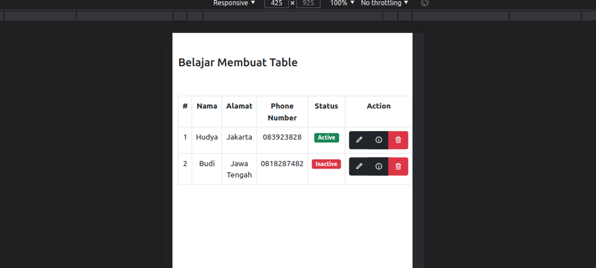
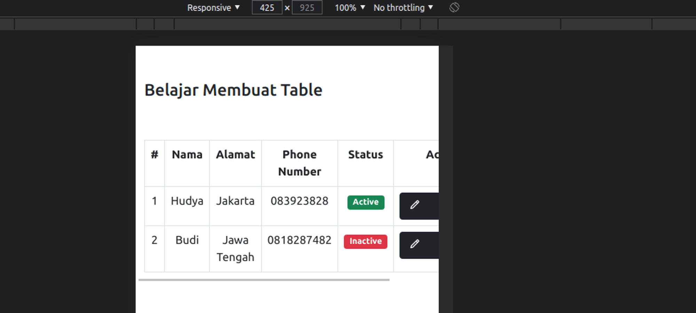

# Part 4 — Bermain dengan Table

# Overview

Pada materi kali ini kita akan coba bermain dengan table pada bootstrap.

# Table

Kita dapat membuat sebuah table yang menarik, cobalah kode berikut:

```html
<!doctype html>
<html lang="en">

<head>
    <!-- Required meta tags -->
    <meta charset="utf-8">
    <meta name="viewport" content="width=device-width, initial-scale=1">

    <!-- Bootstrap CSS -->
    <link href="https://cdn.jsdelivr.net/npm/bootstrap@5.1.0/dist/css/bootstrap.min.css" rel="stylesheet" integrity="sha384-KyZXEAg3QhqLMpG8r+8fhAXLRk2vvoC2f3B09zVXn8CA5QIVfZOJ3BCsw2P0p/We" crossorigin="anonymous">
    <link href='https://unpkg.com/boxicons@2.0.9/css/boxicons.min.css' rel='stylesheet'>

    <title>Hello, world!</title>

    <style>
        .line-outside {
            border: 1px solid #000;
        }
    </style>
</head>

<body>
    <div class="container mt-5">
        <div class="row">
            <div class="col-12">
                <h3>Belajar Membuat Table</h3>
            </div>
        </div>
        <div class="row mt-5">
            <div class="col-12 col-md-8 offset-md-2 text-center table-responsive">
                <table class="table table-hover table-bordered">
                    <tr>
                        <th>#</th>
                        <th>Nama</th>
                        <th>Alamat</th>
                        <th>Phone Number</th>
                        <th>Status</th>
                        <th>Action</th>
                    </tr>
                    <tr>
                        <td>1</td>
                        <td>Hudya</td>
                        <td>Jakarta</td>
                        <td>083923828</td>
                        <td>
                            <span class="badge bg-success">Active</span>
                        </td>
                        <td>
                            <div class="btn-group" role="group" aria-label="Basic example">
                                <a href="#" class="btn btn-dark text-white"><i class='bx bx-pencil'></i></a>
                                <a href="#" class="btn btn-dark text-white"><i class='bx bx-info-circle'></i></a>
                                <a href="#" class="btn btn-danger text-white"><i class='bx bx-trash'></i></a>
                            </div>
                        </td>
                    </tr>

                    <tr>
                        <td>2</td>
                        <td>Budi</td>
                        <td>Jawa Tengah</td>
                        <td>0818287482</td>
                        <td>
                            <span class="badge bg-danger">Inactive</span>
                        </td>
                        <td>
                            <div class="btn-group" role="group" aria-label="Basic example">
                                <a href="#" class="btn btn-dark text-white"><i class='bx bx-pencil'></i></a>
                                <a href="#" class="btn btn-dark text-white"><i class='bx bx-info-circle'></i></a>
                                <a href="#" class="btn btn-danger text-white"><i class='bx bx-trash'></i></a>
                            </div>
                        </td>
                    </tr>
                </table>

            </div>
        </div>

        <script src="https://cdn.jsdelivr.net/npm/bootstrap@5.1.0/dist/js/bootstrap.bundle.min.js" integrity="sha384-U1DAWAznBHeqEIlVSCgzq+c9gqGAJn5c/t99JyeKa9xxaYpSvHU5awsuZVVFIhvj" crossorigin="anonymous"></script>
</body>

</html>
```

Perhatikan kode berikut:

```html
<div class="col-12 col-md-8 offset-md-2 text-center table-responsive">
```



Tampilan tanpa class `table-responsive`



Table dengan class `table-responsive`

Cobalah bandingkan kedua hasil di atas, terlihat sangat berbeda bukan? Table dengan class `table-responsive` memiliki tampilan yang lebih baik, hal ini dikarenakan table menjadi responsive mengikuti layar handphone sehingga bisa digeser kekanan. Sedangkan table yang tidak menggunakannya cenderung menjadi dempet.