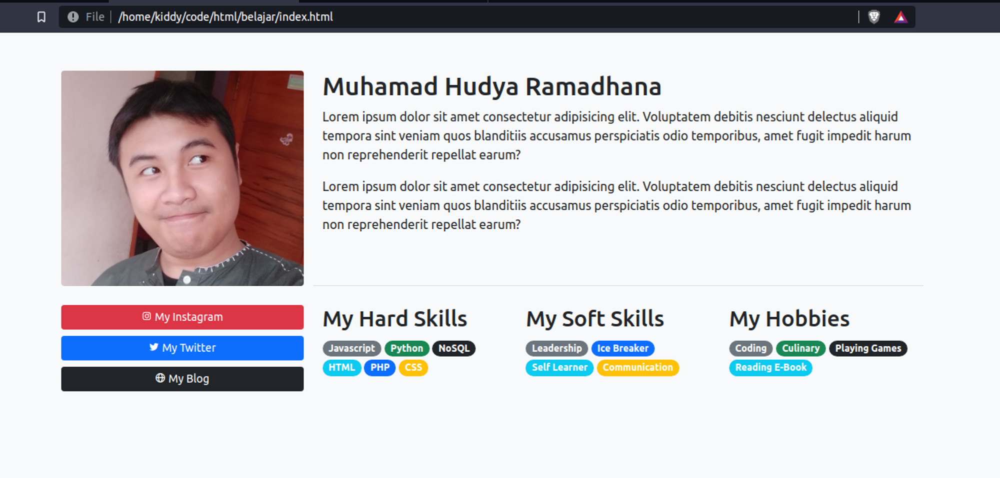
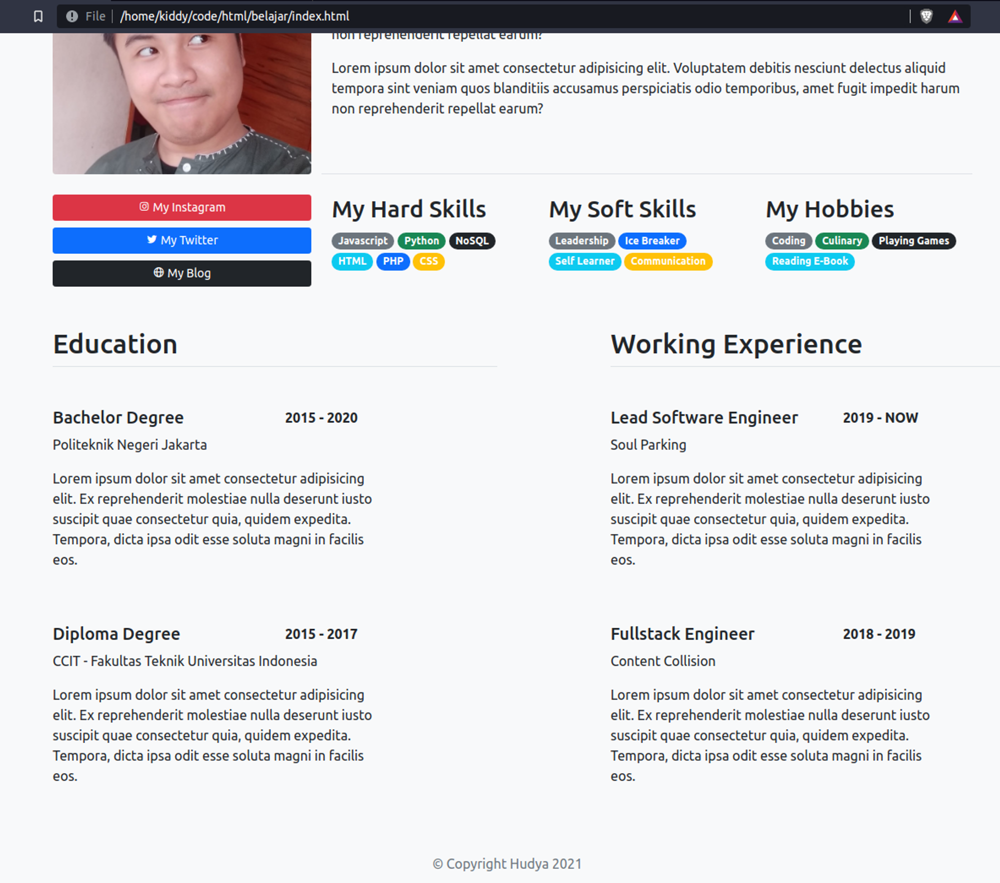
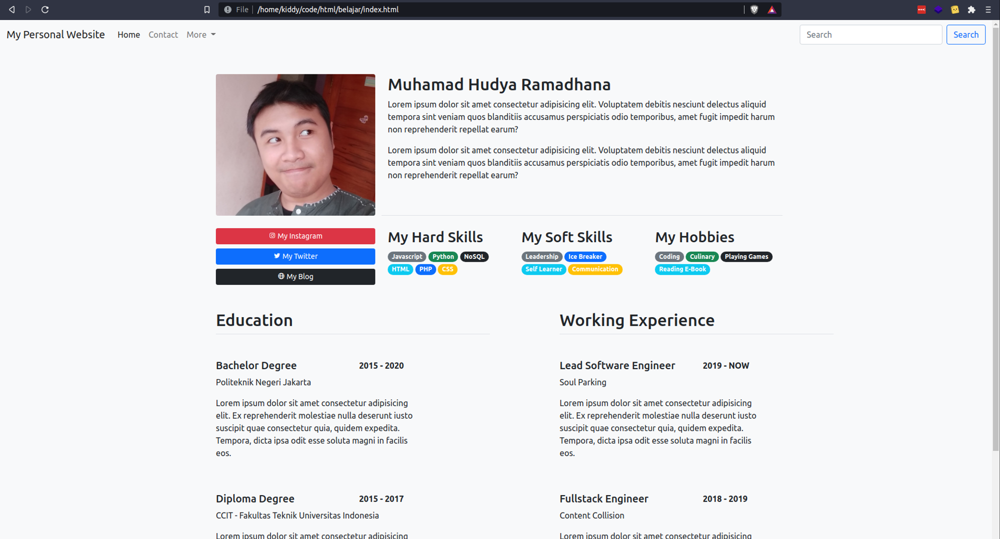

# Part 6 — Membuat Web Personal Sederhana

# Overview

Setelah kamu belajar banyak hal mengenai dasar bootstrap, layouting, component, table, dan juga form, sudah saatnya kamu melangkah lebih jauh. Mari kita membuat sebuah web personal yang sederhana namun classy.

# Buat Folder & File

Buatlah sebuah folder pada direktori komputermu, setelahnya buat sebuah file bernama `index.html`.

# Buat Base Code

Silahkan kamu tambahkan base code berikut untuk membuat bootstrap, kita akan membuat konten yang rapih untuk membuat sebuah web personal sederhana. Masukkan kode berikut pada `index.html` yang telah dibuat.

```html
<!doctype html>
<html lang="en">

<head>
    <!-- Required meta tags -->
    <meta charset="utf-8">
    <meta name="viewport" content="width=device-width, initial-scale=1">

    <!-- Bootstrap CSS -->
    <link href="https://cdn.jsdelivr.net/npm/bootstrap@5.1.0/dist/css/bootstrap.min.css" rel="stylesheet" integrity="sha384-KyZXEAg3QhqLMpG8r+8fhAXLRk2vvoC2f3B09zVXn8CA5QIVfZOJ3BCsw2P0p/We" crossorigin="anonymous">
    <link href='https://unpkg.com/boxicons@2.0.9/css/boxicons.min.css' rel='stylesheet'>

    <title>Hello, world!</title>

    <style>
        .line-outside {
            border: 1px solid #000;
        }
    </style>
</head>

<body class="bg-light">

    <script src="https://cdn.jsdelivr.net/npm/bootstrap@5.1.0/dist/js/bootstrap.bundle.min.js" integrity="sha384-U1DAWAznBHeqEIlVSCgzq+c9gqGAJn5c/t99JyeKa9xxaYpSvHU5awsuZVVFIhvj" crossorigin="anonymous"></script>
</body>

</html>
```

# Tambahkan Konten Pertama

Kita akan menambahkan konten pertama, yaitu bagian nama dan juga foto. Silahkan tambahkan kode berikut di dalam tag body:

```html
<div class="container mt-5">
        <div class="row">
            <div class="col-12 col-md-3 offset-md-1">
                
            </div>
            <div class="col-12 col-md-7 offset-md-0 px-auto border-bottom pb-5">
                <h2>Muhamad Hudya Ramadhana</h2>
                <p>Lorem ipsum dolor sit amet consectetur adipisicing elit. Voluptatem debitis nesciunt delectus aliquid tempora sint veniam quos blanditiis accusamus perspiciatis odio temporibus, amet fugit impedit harum non reprehenderit repellat earum?</p>
                <p>Lorem ipsum dolor sit amet consectetur adipisicing elit. Voluptatem debitis nesciunt delectus aliquid tempora sint veniam quos blanditiis accusamus perspiciatis odio temporibus, amet fugit impedit harum non reprehenderit repellat earum?</p>
            </div>
        </div>
    </div>
```

> [!NOTE]
> 💡 Kamu dapat mengganti nama saya dengan nama asli kamu

## Menambahkan Foto

Silahkan copy salah satu foto pada direktori komputermu ke dalam folder belajar bootstrap (harus satu folder yang sama), setelahnya ganti namanya menjadi `my-photo.png`, atau kamu dapat mengganti nama foto pada source tag img mengikuti nama foto tersebut.

> [!NOTE]
> 💡 Apabila kamu memasukkan foto pada folder images di dalam folder belajar bootstrapmu, maka tambahkan `<namafolder>/namafile.jpg` pada atribut source tag img. Contoh: `src="images/foto.png"`


# Menambahkan Bagian Kedua

Kita akan menambahkan bagian kedua yaitu sosial media dan kemampuan pribadi, silahkan masukkan code berikut:

> [!NOTE]
> 💡 Pastikan kode ditambahkan pada bagian dalam tag div dengan class container.


```html
<div class="row mt-4">
            <div class="col-12 col-md-3 offset-md-1">
                <div class="d-grid gap-2">
                    <a class="btn btn-sm btn-block btn-danger text-white" href="#"><i class='bx bxl-instagram'></i> My Instagram</a>
                    <a class="btn btn-sm btn-block btn-primary text-white" href="#"><i class='bx bxl-twitter'></i> My Twitter</a>
                    <a class="btn btn-sm btn-block btn-dark text-white" href="#"><i class='bx bx-globe'></i> My Blog</a>
                </div>
            </div>
            <div class="col-12 col-md-7 offset-md-0 px auto">
                <div class="row">
                    <div class="col-md-4 col-6">
                        <h3>My Hard Skills</h3>
                        <span class="badge rounded-pill bg-secondary">Javascript</span>
                        <span class="badge rounded-pill bg-success">Python</span>
                        <span class="badge rounded-pill bg-dark">NoSQL</span>
                        <span class="badge rounded-pill bg-info">HTML</span>
                        <span class="badge rounded-pill bg-primary">PHP</span>
                        <span class="badge rounded-pill bg-warning">CSS</span>
                    </div>
                    <div class="col-md-4 col-6">
                        <h3>My Soft Skills</h3>
                        <span class="badge rounded-pill bg-secondary">Leadership</span>
                        <span class="badge rounded-pill bg-primary">Ice Breaker</span>
                        <span class="badge rounded-pill bg-info">Self Learner</span>
                        <span class="badge rounded-pill bg-warning">Communication</span>
                    </div>
                    <div class="col-md-4 col-6">
                        <h3>My Hobbies</h3>
                        <span class="badge rounded-pill bg-secondary">Coding</span>
                        <span class="badge rounded-pill bg-success">Culinary</span>
                        <span class="badge rounded-pill bg-dark">Playing Games</span>
                        <span class="badge rounded-pill bg-info">Reading E-Book</span>
                    </div>
                </div>
            </div>
        </div>
```

> [!NOTE]
> 💡 Silahkan ganti skill sesuai yang kamu inginkan.

Keseluruhan code sekarang seperti ini

```html
<!doctype html>
<html lang="en">

<head>
    <!-- Required meta tags -->
    <meta charset="utf-8">
    <meta name="viewport" content="width=device-width, initial-scale=1">

    <!-- Bootstrap CSS -->
    <link href="https://cdn.jsdelivr.net/npm/bootstrap@5.1.0/dist/css/bootstrap.min.css" rel="stylesheet" integrity="sha384-KyZXEAg3QhqLMpG8r+8fhAXLRk2vvoC2f3B09zVXn8CA5QIVfZOJ3BCsw2P0p/We" crossorigin="anonymous">
    <link href='https://unpkg.com/boxicons@2.0.9/css/boxicons.min.css' rel='stylesheet'>

    <title>Hello, world!</title>

    <style>
        .line-outside {
            border: 1px solid #000;
        }
    </style>
</head>

<body class="bg-light">

    <div class="container mt-5">
        <div class="row">
            <div class="col-12 col-md-3 offset-md-1">
                
            </div>
            <div class="col-12 col-md-7 offset-md-0 px-auto border-bottom pb-5">
                <h2>Muhamad Hudya Ramadhana</h2>
                <p>Lorem ipsum dolor sit amet consectetur adipisicing elit. Voluptatem debitis nesciunt delectus aliquid tempora sint veniam quos blanditiis accusamus perspiciatis odio temporibus, amet fugit impedit harum non reprehenderit repellat earum?</p>
                <p>Lorem ipsum dolor sit amet consectetur adipisicing elit. Voluptatem debitis nesciunt delectus aliquid tempora sint veniam quos blanditiis accusamus perspiciatis odio temporibus, amet fugit impedit harum non reprehenderit repellat earum?</p>
            </div>
        </div>

        <div class="row mt-4">
            <div class="col-12 col-md-3 offset-md-1">
                <div class="d-grid gap-2">
                    <a class="btn btn-sm btn-block btn-danger text-white" href="#"><i class='bx bxl-instagram'></i> My Instagram</a>
                    <a class="btn btn-sm btn-block btn-primary text-white" href="#"><i class='bx bxl-twitter'></i> My Twitter</a>
                    <a class="btn btn-sm btn-block btn-dark text-white" href="#"><i class='bx bx-globe'></i> My Blog</a>
                </div>
            </div>
            <div class="col-12 col-md-7 offset-md-0 px auto">
                <div class="row">
                    <div class="col-md-4 col-6">
                        <h3>My Hard Skills</h3>
                        <span class="badge rounded-pill bg-secondary">Javascript</span>
                        <span class="badge rounded-pill bg-success">Python</span>
                        <span class="badge rounded-pill bg-dark">NoSQL</span>
                        <span class="badge rounded-pill bg-info">HTML</span>
                        <span class="badge rounded-pill bg-primary">PHP</span>
                        <span class="badge rounded-pill bg-warning">CSS</span>
                    </div>
                    <div class="col-md-4 col-6">
                        <h3>My Soft Skills</h3>
                        <span class="badge rounded-pill bg-secondary">Leadership</span>
                        <span class="badge rounded-pill bg-primary">Ice Breaker</span>
                        <span class="badge rounded-pill bg-info">Self Learner</span>
                        <span class="badge rounded-pill bg-warning">Communication</span>
                    </div>
                    <div class="col-md-4 col-6">
                        <h3>My Hobbies</h3>
                        <span class="badge rounded-pill bg-secondary">Coding</span>
                        <span class="badge rounded-pill bg-success">Culinary</span>
                        <span class="badge rounded-pill bg-dark">Playing Games</span>
                        <span class="badge rounded-pill bg-info">Reading E-Book</span>
                    </div>
                </div>
            </div>
        </div>
    </div>
    <script src="https://cdn.jsdelivr.net/npm/bootstrap@5.1.0/dist/js/bootstrap.bundle.min.js" integrity="sha384-U1DAWAznBHeqEIlVSCgzq+c9gqGAJn5c/t99JyeKa9xxaYpSvHU5awsuZVVFIhvj" crossorigin="anonymous"></script>
</body>

</html>
```

## Hasil Sementara



# Tambahkan Bagian Ketiga

Kita ingin menambahkan pengalaman kerja dan pendidikan pada bagian bawah, mari tambahkan kode berikut:

```html
<div class="row mt-5 mb-5">
            <div class="col-12 col-md-5 offset-md-1">
                <h2 class="border-bottom pb-2">Education</h2>
                <div class="row mt-5">
                    <div class="col-6">
                        <h5>Bachelor Degree</h5>
                    </div>
                    <div class="col-6 text-right">
                        <span><strong>2015 - 2020</strong></span>
                    </div>
                    <div class="col-9">
                        <p>Politeknik Negeri Jakarta</p>
                        <p>Lorem ipsum dolor sit amet consectetur adipisicing elit. Ex reprehenderit molestiae nulla deserunt iusto suscipit quae consectetur quia, quidem expedita. Tempora, dicta ipsa odit esse soluta magni in facilis eos.</p>
                    </div>
                </div>
                <div class="row mt-5">
                    <div class="col-6">
                        <h5>Diploma Degree</h5>
                    </div>
                    <div class="col-6 text-right">
                        <span><strong>2015 - 2017</strong></span>
                    </div>
                    <div class="col-9">
                        <p>CCIT - Fakultas Teknik Universitas Indonesia</p>
                        <p>Lorem ipsum dolor sit amet consectetur adipisicing elit. Ex reprehenderit molestiae nulla deserunt iusto suscipit quae consectetur quia, quidem expedita. Tempora, dicta ipsa odit esse soluta magni in facilis eos.</p>
                    </div>
                </div>
            </div>
            <div class="col-12 col-md-5 offset-md-1">
                <h2 class="border-bottom pb-2">Working Experience</h2>
                <div class="row mt-5">
                    <div class="col-6">
                        <h5>Lead Software Engineer</h5>
                    </div>
                    <div class="col-6 text-right">
                        <span><strong>2019 - NOW</strong></span>
                    </div>
                    <div class="col-9">
                        <p>Soul Parking</p>
                        <p>Lorem ipsum dolor sit amet consectetur adipisicing elit. Ex reprehenderit molestiae nulla deserunt iusto suscipit quae consectetur quia, quidem expedita. Tempora, dicta ipsa odit esse soluta magni in facilis eos.</p>
                    </div>
                </div>
                <div class="row mt-5">
                    <div class="col-6">
                        <h5>Fullstack Engineer</h5>
                    </div>
                    <div class="col-6 text-right">
                        <span><strong>2018 - 2019</strong></span>
                    </div>
                    <div class="col-9">
                        <p>Content Collision</p>
                        <p>Lorem ipsum dolor sit amet consectetur adipisicing elit. Ex reprehenderit molestiae nulla deserunt iusto suscipit quae consectetur quia, quidem expedita. Tempora, dicta ipsa odit esse soluta magni in facilis eos.</p>
                    </div>
                </div>
            </div>
        </div>
```

# Tambahkan Footer

Kita Perlu menambahkan footer untuk mempercantik website kita, coba tambahkan kode berikut sejajar dengan kode di atas:

```html
<footer class="footer mt-auto py-3 bg-light mt-5">
            <div class="container text-center">
                <span class="text-muted">&copy; Copyright Hudya 2021</span>
            </div>
        </footer>
```

Keseluruhan code sekarang menjadi seperti ini:

```html
<!doctype html>
<html lang="en">

<head>
    <!-- Required meta tags -->
    <meta charset="utf-8">
    <meta name="viewport" content="width=device-width, initial-scale=1">

    <!-- Bootstrap CSS -->
    <link href="https://cdn.jsdelivr.net/npm/bootstrap@5.1.0/dist/css/bootstrap.min.css" rel="stylesheet" integrity="sha384-KyZXEAg3QhqLMpG8r+8fhAXLRk2vvoC2f3B09zVXn8CA5QIVfZOJ3BCsw2P0p/We" crossorigin="anonymous">
    <link href='https://unpkg.com/boxicons@2.0.9/css/boxicons.min.css' rel='stylesheet'>

    <title>Hello, world!</title>

    <style>
        .line-outside {
            border: 1px solid #000;
        }
    </style>
</head>

<body class="bg-light">
    <div class="container mt-5">
        <div class="row">
            <div class="col-12 col-md-3 offset-md-1">
                
            </div>
            <div class="col-12 col-md-7 offset-md-0 px-auto border-bottom pb-5">
                <h2>Muhamad Hudya Ramadhana</h2>
                <p>Lorem ipsum dolor sit amet consectetur adipisicing elit. Voluptatem debitis nesciunt delectus aliquid tempora sint veniam quos blanditiis accusamus perspiciatis odio temporibus, amet fugit impedit harum non reprehenderit repellat earum?</p>
                <p>Lorem ipsum dolor sit amet consectetur adipisicing elit. Voluptatem debitis nesciunt delectus aliquid tempora sint veniam quos blanditiis accusamus perspiciatis odio temporibus, amet fugit impedit harum non reprehenderit repellat earum?</p>
            </div>
        </div>

        <div class="row mt-4">
            <div class="col-12 col-md-3 offset-md-1">
                <div class="d-grid gap-2">
                    <a class="btn btn-sm btn-block btn-danger text-white" href="#"><i class='bx bxl-instagram'></i> My Instagram</a>
                    <a class="btn btn-sm btn-block btn-primary text-white" href="#"><i class='bx bxl-twitter'></i> My Twitter</a>
                    <a class="btn btn-sm btn-block btn-dark text-white" href="#"><i class='bx bx-globe'></i> My Blog</a>
                </div>
            </div>
            <div class="col-12 col-md-7 offset-md-0 px auto">
                <div class="row">
                    <div class="col-md-4 col-6">
                        <h3>My Hard Skills</h3>
                        <span class="badge rounded-pill bg-secondary">Javascript</span>
                        <span class="badge rounded-pill bg-success">Python</span>
                        <span class="badge rounded-pill bg-dark">NoSQL</span>
                        <span class="badge rounded-pill bg-info">HTML</span>
                        <span class="badge rounded-pill bg-primary">PHP</span>
                        <span class="badge rounded-pill bg-warning">CSS</span>
                    </div>
                    <div class="col-md-4 col-6">
                        <h3>My Soft Skills</h3>
                        <span class="badge rounded-pill bg-secondary">Leadership</span>
                        <span class="badge rounded-pill bg-primary">Ice Breaker</span>
                        <span class="badge rounded-pill bg-info">Self Learner</span>
                        <span class="badge rounded-pill bg-warning">Communication</span>
                    </div>
                    <div class="col-md-4 col-6">
                        <h3>My Hobbies</h3>
                        <span class="badge rounded-pill bg-secondary">Coding</span>
                        <span class="badge rounded-pill bg-success">Culinary</span>
                        <span class="badge rounded-pill bg-dark">Playing Games</span>
                        <span class="badge rounded-pill bg-info">Reading E-Book</span>
                    </div>
                </div>
            </div>
        </div>

        <div class="row mt-5 mb-5">
            <div class="col-12 col-md-5 offset-md-1">
                <h2 class="border-bottom pb-2">Education</h2>
                <div class="row mt-5">
                    <div class="col-6">
                        <h5>Bachelor Degree</h5>
                    </div>
                    <div class="col-6 text-right">
                        <span><strong>2015 - 2020</strong></span>
                    </div>
                    <div class="col-9">
                        <p>Politeknik Negeri Jakarta</p>
                        <p>Lorem ipsum dolor sit amet consectetur adipisicing elit. Ex reprehenderit molestiae nulla deserunt iusto suscipit quae consectetur quia, quidem expedita. Tempora, dicta ipsa odit esse soluta magni in facilis eos.</p>
                    </div>
                </div>
                <div class="row mt-5">
                    <div class="col-6">
                        <h5>Diploma Degree</h5>
                    </div>
                    <div class="col-6 text-right">
                        <span><strong>2015 - 2017</strong></span>
                    </div>
                    <div class="col-9">
                        <p>CCIT - Fakultas Teknik Universitas Indonesia</p>
                        <p>Lorem ipsum dolor sit amet consectetur adipisicing elit. Ex reprehenderit molestiae nulla deserunt iusto suscipit quae consectetur quia, quidem expedita. Tempora, dicta ipsa odit esse soluta magni in facilis eos.</p>
                    </div>
                </div>
            </div>
            <div class="col-12 col-md-5 offset-md-1">
                <h2 class="border-bottom pb-2">Working Experience</h2>
                <div class="row mt-5">
                    <div class="col-6">
                        <h5>Lead Software Engineer</h5>
                    </div>
                    <div class="col-6 text-right">
                        <span><strong>2019 - NOW</strong></span>
                    </div>
                    <div class="col-9">
                        <p>Soul Parking</p>
                        <p>Lorem ipsum dolor sit amet consectetur adipisicing elit. Ex reprehenderit molestiae nulla deserunt iusto suscipit quae consectetur quia, quidem expedita. Tempora, dicta ipsa odit esse soluta magni in facilis eos.</p>
                    </div>
                </div>
                <div class="row mt-5">
                    <div class="col-6">
                        <h5>Fullstack Engineer</h5>
                    </div>
                    <div class="col-6 text-right">
                        <span><strong>2018 - 2019</strong></span>
                    </div>
                    <div class="col-9">
                        <p>Content Collision</p>
                        <p>Lorem ipsum dolor sit amet consectetur adipisicing elit. Ex reprehenderit molestiae nulla deserunt iusto suscipit quae consectetur quia, quidem expedita. Tempora, dicta ipsa odit esse soluta magni in facilis eos.</p>
                    </div>
                </div>
            </div>
        </div>
        <footer class="footer mt-auto py-3 bg-light mt-5">
            <div class="container text-center">
                <span class="text-muted">&copy; Copyright Hudya 2021</span>
            </div>
        </footer>
    </div>
    <script src="https://cdn.jsdelivr.net/npm/bootstrap@5.1.0/dist/js/bootstrap.bundle.min.js" integrity="sha384-U1DAWAznBHeqEIlVSCgzq+c9gqGAJn5c/t99JyeKa9xxaYpSvHU5awsuZVVFIhvj" crossorigin="anonymous"></script>
</body>

</html>
```

## Hasil Sementara



# Tambahkan Navbar

Sekarang kita akan menambahkan navbar untuk membuat website kita menjadi lebih keren. Silahkan tambahkan kode berikut **pada bagian atas tag div dengan class container**.

```html
<nav class="navbar navbar-expand-lg navbar-light">
        <div class="container-fluid">
            <a class="navbar-brand" href="#">My Personal Website</a>
            <button class="navbar-toggler" type="button" data-bs-toggle="collapse" data-bs-target="#navbarSupportedContent" aria-controls="navbarSupportedContent" aria-expanded="false" aria-label="Toggle navigation">
                <span class="navbar-toggler-icon"></span>
            </button>
            <div class="collapse navbar-collapse" id="navbarSupportedContent">
                <ul class="navbar-nav me-auto mb-2 mb-lg-0">
                    <li class="nav-item">
                        <a class="nav-link active" aria-current="page" href="#">Home</a>
                    </li>
                    <li class="nav-item">
                        <a class="nav-link" href="contact.html">Contact</a>
                    </li>
                    <li class="nav-item dropdown">
                        <a class="nav-link dropdown-toggle" href="#" id="navbarDropdown" role="button" data-bs-toggle="dropdown" aria-expanded="false">
                        More
                        </a>
                        <ul class="dropdown-menu" aria-labelledby="navbarDropdown">
                            <li><a class="dropdown-item" href="#">My Portfolio</a></li>
                            <li><a class="dropdown-item" href="#">My Skills</a></li>
                            <li>
                                <hr class="dropdown-divider">
                            </li>
                            <li><a class="dropdown-item" href="#">My Home</a></li>
                        </ul>
                    </li>
                </ul>
                <form class="d-flex">
                    <input class="form-control me-2" type="search" placeholder="Search" aria-label="Search">
                    <button class="btn btn-outline-primary" type="submit">Search</button>
                </form>
            </div>
        </div>
    </nav>
```

Sehingga keseluruhan code menjadi seperti berikut:

```html
<!doctype html>
<html lang="en">

<head>
    <!-- Required meta tags -->
    <meta charset="utf-8">
    <meta name="viewport" content="width=device-width, initial-scale=1">

    <!-- Bootstrap CSS -->
    <link href="https://cdn.jsdelivr.net/npm/bootstrap@5.1.0/dist/css/bootstrap.min.css" rel="stylesheet" integrity="sha384-KyZXEAg3QhqLMpG8r+8fhAXLRk2vvoC2f3B09zVXn8CA5QIVfZOJ3BCsw2P0p/We" crossorigin="anonymous">
    <link href='https://unpkg.com/boxicons@2.0.9/css/boxicons.min.css' rel='stylesheet'>

    <title>Hello, world!</title>

    <style>
        .line-outside {
            border: 1px solid #000;
        }
    </style>
</head>

<body class="bg-light">

    <nav class="navbar navbar-expand-lg navbar-light">
        <div class="container-fluid">
            <a class="navbar-brand" href="#">My Personal Website</a>
            <button class="navbar-toggler" type="button" data-bs-toggle="collapse" data-bs-target="#navbarSupportedContent" aria-controls="navbarSupportedContent" aria-expanded="false" aria-label="Toggle navigation">
                <span class="navbar-toggler-icon"></span>
            </button>
            <div class="collapse navbar-collapse" id="navbarSupportedContent">
                <ul class="navbar-nav me-auto mb-2 mb-lg-0">
                    <li class="nav-item">
                        <a class="nav-link active" aria-current="page" href="#">Home</a>
                    </li>
                    <li class="nav-item">
                        <a class="nav-link" href="contact.html">Contact</a>
                    </li>
                    <li class="nav-item dropdown">
                        <a class="nav-link dropdown-toggle" href="#" id="navbarDropdown" role="button" data-bs-toggle="dropdown" aria-expanded="false">
                        More
                        </a>
                        <ul class="dropdown-menu" aria-labelledby="navbarDropdown">
                            <li><a class="dropdown-item" href="#">My Portfolio</a></li>
                            <li><a class="dropdown-item" href="#">My Skills</a></li>
                            <li>
                                <hr class="dropdown-divider">
                            </li>
                            <li><a class="dropdown-item" href="#">My Home</a></li>
                        </ul>
                    </li>
                </ul>
                <form class="d-flex">
                    <input class="form-control me-2" type="search" placeholder="Search" aria-label="Search">
                    <button class="btn btn-outline-primary" type="submit">Search</button>
                </form>
            </div>
        </div>
    </nav>
    <div class="container mt-5">
        <div class="row">
            <div class="col-12 col-md-3 offset-md-1">
                
            </div>
            <div class="col-12 col-md-7 offset-md-0 px-auto border-bottom pb-5">
                <h2>Muhamad Hudya Ramadhana</h2>
                <p>Lorem ipsum dolor sit amet consectetur adipisicing elit. Voluptatem debitis nesciunt delectus aliquid tempora sint veniam quos blanditiis accusamus perspiciatis odio temporibus, amet fugit impedit harum non reprehenderit repellat earum?</p>
                <p>Lorem ipsum dolor sit amet consectetur adipisicing elit. Voluptatem debitis nesciunt delectus aliquid tempora sint veniam quos blanditiis accusamus perspiciatis odio temporibus, amet fugit impedit harum non reprehenderit repellat earum?</p>
            </div>
        </div>

        <div class="row mt-4">
            <div class="col-12 col-md-3 offset-md-1">
                <div class="d-grid gap-2">
                    <a class="btn btn-sm btn-block btn-danger text-white" href="#"><i class='bx bxl-instagram'></i> My Instagram</a>
                    <a class="btn btn-sm btn-block btn-primary text-white" href="#"><i class='bx bxl-twitter'></i> My Twitter</a>
                    <a class="btn btn-sm btn-block btn-dark text-white" href="#"><i class='bx bx-globe'></i> My Blog</a>
                </div>
            </div>
            <div class="col-12 col-md-7 offset-md-0 px auto">
                <div class="row">
                    <div class="col-md-4 col-6">
                        <h3>My Hard Skills</h3>
                        <span class="badge rounded-pill bg-secondary">Javascript</span>
                        <span class="badge rounded-pill bg-success">Python</span>
                        <span class="badge rounded-pill bg-dark">NoSQL</span>
                        <span class="badge rounded-pill bg-info">HTML</span>
                        <span class="badge rounded-pill bg-primary">PHP</span>
                        <span class="badge rounded-pill bg-warning">CSS</span>
                    </div>
                    <div class="col-md-4 col-6">
                        <h3>My Soft Skills</h3>
                        <span class="badge rounded-pill bg-secondary">Leadership</span>
                        <span class="badge rounded-pill bg-primary">Ice Breaker</span>
                        <span class="badge rounded-pill bg-info">Self Learner</span>
                        <span class="badge rounded-pill bg-warning">Communication</span>
                    </div>
                    <div class="col-md-4 col-6">
                        <h3>My Hobbies</h3>
                        <span class="badge rounded-pill bg-secondary">Coding</span>
                        <span class="badge rounded-pill bg-success">Culinary</span>
                        <span class="badge rounded-pill bg-dark">Playing Games</span>
                        <span class="badge rounded-pill bg-info">Reading E-Book</span>
                    </div>
                </div>
            </div>
        </div>

        <div class="row mt-5 mb-5">
            <div class="col-12 col-md-5 offset-md-1">
                <h2 class="border-bottom pb-2">Education</h2>
                <div class="row mt-5">
                    <div class="col-6">
                        <h5>Bachelor Degree</h5>
                    </div>
                    <div class="col-6 text-right">
                        <span><strong>2015 - 2020</strong></span>
                    </div>
                    <div class="col-9">
                        <p>Politeknik Negeri Jakarta</p>
                        <p>Lorem ipsum dolor sit amet consectetur adipisicing elit. Ex reprehenderit molestiae nulla deserunt iusto suscipit quae consectetur quia, quidem expedita. Tempora, dicta ipsa odit esse soluta magni in facilis eos.</p>
                    </div>
                </div>
                <div class="row mt-5">
                    <div class="col-6">
                        <h5>Diploma Degree</h5>
                    </div>
                    <div class="col-6 text-right">
                        <span><strong>2015 - 2017</strong></span>
                    </div>
                    <div class="col-9">
                        <p>CCIT - Fakultas Teknik Universitas Indonesia</p>
                        <p>Lorem ipsum dolor sit amet consectetur adipisicing elit. Ex reprehenderit molestiae nulla deserunt iusto suscipit quae consectetur quia, quidem expedita. Tempora, dicta ipsa odit esse soluta magni in facilis eos.</p>
                    </div>
                </div>
            </div>
            <div class="col-12 col-md-5 offset-md-1">
                <h2 class="border-bottom pb-2">Working Experience</h2>
                <div class="row mt-5">
                    <div class="col-6">
                        <h5>Lead Software Engineer</h5>
                    </div>
                    <div class="col-6 text-right">
                        <span><strong>2019 - NOW</strong></span>
                    </div>
                    <div class="col-9">
                        <p>Soul Parking</p>
                        <p>Lorem ipsum dolor sit amet consectetur adipisicing elit. Ex reprehenderit molestiae nulla deserunt iusto suscipit quae consectetur quia, quidem expedita. Tempora, dicta ipsa odit esse soluta magni in facilis eos.</p>
                    </div>
                </div>
                <div class="row mt-5">
                    <div class="col-6">
                        <h5>Fullstack Engineer</h5>
                    </div>
                    <div class="col-6 text-right">
                        <span><strong>2018 - 2019</strong></span>
                    </div>
                    <div class="col-9">
                        <p>Content Collision</p>
                        <p>Lorem ipsum dolor sit amet consectetur adipisicing elit. Ex reprehenderit molestiae nulla deserunt iusto suscipit quae consectetur quia, quidem expedita. Tempora, dicta ipsa odit esse soluta magni in facilis eos.</p>
                    </div>
                </div>
            </div>
        </div>
        <footer class="footer mt-auto py-3 bg-light mt-5">
            <div class="container text-center">
                <span class="text-muted">&copy; Copyright Hudya 2021</span>
            </div>
        </footer>
    </div>
    <script src="https://cdn.jsdelivr.net/npm/bootstrap@5.1.0/dist/js/bootstrap.bundle.min.js" integrity="sha384-U1DAWAznBHeqEIlVSCgzq+c9gqGAJn5c/t99JyeKa9xxaYpSvHU5awsuZVVFIhvj" crossorigin="anonymous"></script>
</body>

</html>
```

## Hasil Akhir



# Buat File Kontak

Sekarang buatlah sebuah file contact.html dan tambahkan kode berikut:

```html
<!doctype html>
<html lang="en">

<head>
    <!-- Required meta tags -->
    <meta charset="utf-8">
    <meta name="viewport" content="width=device-width, initial-scale=1">

    <!-- Bootstrap CSS -->
    <link href="https://cdn.jsdelivr.net/npm/bootstrap@5.1.0/dist/css/bootstrap.min.css" rel="stylesheet" integrity="sha384-KyZXEAg3QhqLMpG8r+8fhAXLRk2vvoC2f3B09zVXn8CA5QIVfZOJ3BCsw2P0p/We" crossorigin="anonymous">
    <link href='https://unpkg.com/boxicons@2.0.9/css/boxicons.min.css' rel='stylesheet'>

    <title>Hello, world!</title>

    <style>
        .line-outside {
            border: 1px solid #000;
        }
    </style>
</head>

<body class="bg-light">

    <nav class="navbar navbar-expand-lg navbar-light">
        <div class="container-fluid">
            <a class="navbar-brand" href="#">My Personal Website</a>
            <button class="navbar-toggler" type="button" data-bs-toggle="collapse" data-bs-target="#navbarSupportedContent" aria-controls="navbarSupportedContent" aria-expanded="false" aria-label="Toggle navigation">
                <span class="navbar-toggler-icon"></span>
            </button>
            <div class="collapse navbar-collapse" id="navbarSupportedContent">
                <ul class="navbar-nav me-auto mb-2 mb-lg-0">
                    <li class="nav-item">
                        <a class="nav-link active" aria-current="page" href="index.html">Home</a>
                    </li>
                    <li class="nav-item">
                        <a class="nav-link" href="#">Contact</a>
                    </li>
                    <li class="nav-item dropdown">
                        <a class="nav-link dropdown-toggle" href="#" id="navbarDropdown" role="button" data-bs-toggle="dropdown" aria-expanded="false">
                        More
                        </a>
                        <ul class="dropdown-menu" aria-labelledby="navbarDropdown">
                            <li><a class="dropdown-item" href="#">My Portfolio</a></li>
                            <li><a class="dropdown-item" href="#">My Skills</a></li>
                            <li>
                                <hr class="dropdown-divider">
                            </li>
                            <li><a class="dropdown-item" href="#">My Home</a></li>
                        </ul>
                    </li>
                </ul>
                <form class="d-flex">
                    <input class="form-control me-2" type="search" placeholder="Search" aria-label="Search">
                    <button class="btn btn-outline-primary" type="submit">Search</button>
                </form>
            </div>
        </div>
    </nav>
    <div class="container mt-5">
        <div class="row">
            <div class="col-12 col-md-6 offset-md-2 px-auto border-bottom pb-5">
                <h2>Contact us</h2>
                <form class="mx-auto mt-5" method="GET">
                    <div class="mb-3">
                        <label class="form-label">Nama</label>
                        <input type="text" class="form-control" id="exampleFormControlInput1" placeholder="Masukkan nama anda" required>
                    </div>
                    <div class="mb-3">
                        <label class="form-label">Email</label>
                        <input type="email" class="form-control" id="exampleFormControlInput1" placeholder="Masukkan email anda. Contoh: name@example.com" required>
                    </div>
                    <div class="mb-3">
                        <label class="form-label">Pesan Anda</label>
                        <textarea class="form-control" id="exampleFormControlTextarea1" placeholder="Masukkan alamat pengguna" rows="3" required></textarea>
                    </div>
                    <div class="mb-3 mt-5 text-center">
                        <button type="submit" class="btn btn-primary form-control">Submit</button>
                    </div>
                </form>
            </div>

            <footer class="footer mt-auto py-3 bg-light mt-5">
                <div class="container text-center">
                    <span class="text-muted">&copy; Copyright Hudya 2021</span>
            </footer>

            <script src="https://cdn.jsdelivr.net/npm/bootstrap@5.1.0/dist/js/bootstrap.bundle.min.js" integrity="sha384-U1DAWAznBHeqEIlVSCgzq+c9gqGAJn5c/t99JyeKa9xxaYpSvHU5awsuZVVFIhvj" crossorigin="anonymous"></script>
</body>

</html>
```

# Hasil Akhir Website


Selamat Kamu sudah berhasil membuat sebuah website menggunakan Bootstrap 5!