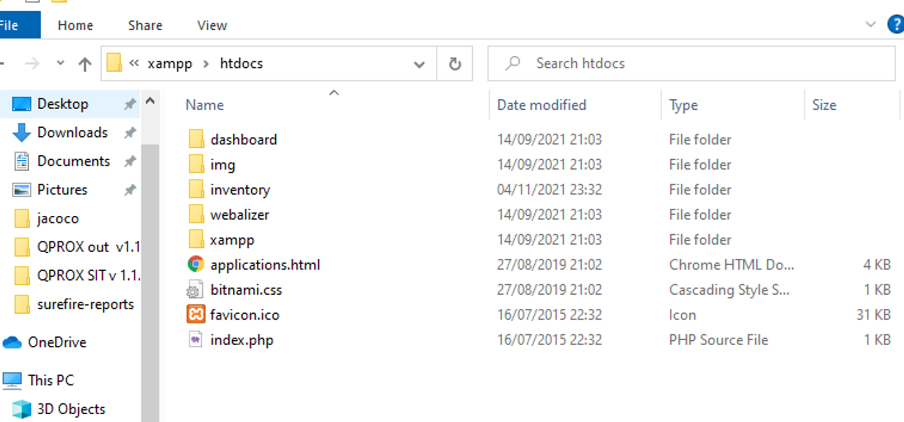
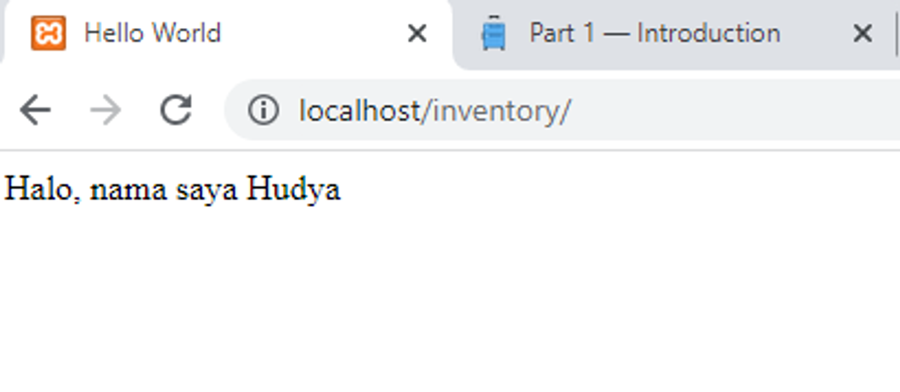

# Part 1 — Introduction to Web with PHP Native

# Overview

Pada materi ini kita akan belajar banyak hal tentang PHP, tapi pada materi ini kita tidak akan belajar banyak hal dasar di PHP.

Mengapa? Karena pada dasarnya PHP sama saja seperti bahasa pemrograman lainnya, hanya saja beda penulisannya saja. Jikalau kamu ingin belajar fundamental silahkan saja belajar [disini ya](https://www.w3schools.com/php/) 😄.

# Tools

Tutorial ini menggunakan PHPMyAdmin agar mempermudah teman-teman di Windows. Untuk mendownload silahkan klik disini:

- [Apache Friends](https://www.apachefriends.org/index.html)

Untuk Linux khususnya ubuntu coba cek disini ya:

- [Install XAMPP di Ubuntu 18.04](https://medium.com/@avinriyan/install-xampp-di-ubuntu-18-04-33661b62dad5)

Untuk melakukan koding, kita memerlukan tools bernama VSCode. Silahkan download disini.

- [Visual Studio Code - Code Editing.](https://code.visualstudio.com/)

# Folder Program

Untuk memulai program pada PHP, kita perlu membuka folder tempat penyimpanan xampp kita, lalu pilih folder htdocs.



Buatlah folder bernama `inventory`. Kita akan belajar membuat CRUD untuk inventory barang.

# Hello World

Buatlah file bernama `index.php` pada folder inventory lalu masukkan kode berikut:

```php
<?php
 echo "Hello World";
?>
```

Sekarang kita rombak menjadi seperti ini:

```php
<?php
  $name = "Hudya";
    $usia = 12;
?>

<html>
    <head>
        <title>Hello World</title>
    </head>
    <body>
        <p>Halo, nama saya <?= $name ?></p>
        <p>Usia saya adalah <?php echo $usia ?> tahun</p>
    </body>
</html>
```

Sekarang lihat hasilnya:



Mudah sekali kan menggunakan PHP? Kita dapat menggabungkan PHP dan HTML pada satu file.

Sekarang apa bedanya antara:

```php
<?= $variable ?> 
```

dan:

```php
<?php echo $usia ?>
```

Kode yang atas tidak membutuhkan syntax echo karena itu merupakan singkatan dari php echo. Syntax `echo` pada php artinya mencetak variable. Jadi kedua code tidak ada yang salah.

Sekarang kita ubah kodenya menjadi seperti ini:

```php
<?php
    $usia = 12;

    function returnName($name) {
        return "nama saya adalah " . $name;
    }
?>

<html>
    <head>
        <title>Hello World</title>
    </head>
    <body>
        <p>Halo, <?= returnName("Hudya") ?></p>
        <p>Usia saya adalah <?php echo $usia ?> tahun</p>
    </body>
</html>
```

Kode kita saat ini dapat menampilkan kalimat melalui fungsi yang kita buat.

Sekarang buat file baru bernama `sum.php` lalu masukkan kode dibawah:

```php
<?php
    $result = null;

    if ($_SERVER["REQUEST_METHOD"] == "POST") {
        
        $x = $_POST['bilangan1'];
        $y = $_POST['bilangan2'];

        $result = sum($x, $y);
    }

    function sum($x, $y) {
        return $x + $y;
    }
?>

<html>
    <head>
        <title>Hello World</title>
    </head>
    <body>
        <?php if ($result == null) { ?>
            <form action="sum.php" method="post"> 
                <input type="text" name="bilangan1" placeholder="Masukkan nilai pertama" />
                <input type="text" name="bilangan2" placeholder="Masukkan nilai kedua" /> 
                <input type="submit" name="submit" /> 
            </form>
        <?php } else { ?>
            <p>Hasilnya adalah <?= $result ?> </p>
        <?php } ?>
        
    </body>
</html>
```

Sekarang kita berhasil membuat kalkulator sederhana.
