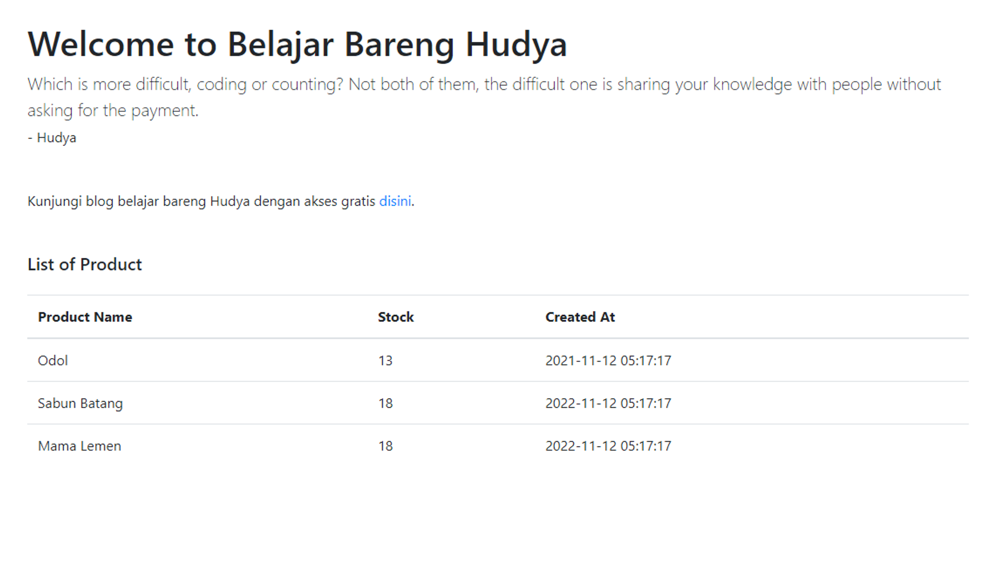

# Part 3 - Connection, Read & Create

# Overview

Setelah belajar templating, pada kali ini kita akan coba melakukan koneksi pada PHP dengan MySQL alias MariaDB.

# Buat Database

Buatlah database dengan nama `inventory`, lalu masukkan script SQL berikut untuk membuat table inventory:

```sql
-- phpMyAdmin SQL Dump
-- version 5.1.1
-- https://www.phpmyadmin.net/
--
-- Host: 127.0.0.1
-- Generation Time: Nov 12, 2021 at 05:14 AM
-- Server version: 10.4.21-MariaDB
-- PHP Version: 7.4.23

SET SQL_MODE = "NO_AUTO_VALUE_ON_ZERO";
START TRANSACTION;
SET time_zone = "+00:00";

/*!40101 SET @OLD_CHARACTER_SET_CLIENT=@@CHARACTER_SET_CLIENT */;
/*!40101 SET @OLD_CHARACTER_SET_RESULTS=@@CHARACTER_SET_RESULTS */;
/*!40101 SET @OLD_COLLATION_CONNECTION=@@COLLATION_CONNECTION */;
/*!40101 SET NAMES utf8mb4 */;

--
-- Database: `inventory`
--

-- --------------------------------------------------------

--
-- Table structure for table `inventory`
--

CREATE TABLE `inventory` (
  `id` int(11) NOT NULL,
  `name` varchar(250) NOT NULL,
  `stock` int(11) NOT NULL,
  `category_id` int(11) DEFAULT NULL,
  `expired_at` datetime DEFAULT NULL,
  `created_at` timestamp NOT NULL DEFAULT current_timestamp(),
  `updated_at` timestamp NOT NULL DEFAULT current_timestamp(),
  `deleted_at` datetime DEFAULT NULL
) ENGINE=InnoDB DEFAULT CHARSET=utf8mb4;

--
-- Indexes for dumped tables
--

--
-- Indexes for table `inventory`
--
ALTER TABLE `inventory`
  ADD PRIMARY KEY (`id`);

--
-- AUTO_INCREMENT for dumped tables
--

--
-- AUTO_INCREMENT for table `inventory`
--
ALTER TABLE `inventory`
  MODIFY `id` int(11) NOT NULL AUTO_INCREMENT;
COMMIT;

/*!40101 SET CHARACTER_SET_CLIENT=@OLD_CHARACTER_SET_CLIENT */;
/*!40101 SET CHARACTER_SET_RESULTS=@OLD_CHARACTER_SET_RESULTS */;
/*!40101 SET COLLATION_CONNECTION=@OLD_COLLATION_CONNECTION */;
```

# Buat Bolder Baru

Buatlah dua folder baru yaitu database dan controller dimana file ini akan menjadi tempat kita untuk melakukan koneksi ke DB.


Sekarang di dalam folder database buatlah file bernama `connection.php` lalu masukkan kode di bawah ini:

```php
<?php
    class ConnectionDatabase {
        var $db_host = "localhost";
        var $db_username = "root";
        var $db_pass = "";
        var $db_name = "inventory";

        function __construct()
        {
            $this->connection = new mysqli(
                $this->db_host, 
                $this->db_username, 
                $this->db_pass, 
                $this->db_name
            );

            mysqli_select_db($this->connection, $this->db_name);
            
            if(mysqli_connect_error()) {
                echo "Connections is failed to connect " . mysqli_connect_error();
            }
        }

        function closeConnection() {
            return $this->connection->close();
        }
    }
    
?>
```

Masih di folder yang sama, kita buat file bernama `inventory.php` sebagai jembatan yang akan menghubungkan table inventory ke proyek kita.

```php
<?php
    include('connection.php');

    class Inventory {

        function __construct()
        {
            $this->database = new ConnectionDatabase();
        }

        function getAll(){
            $query = "SELECT * FROM inventory";
            $data = mysqli_query($this->database->connection, $query);
            
            $res = [];
    
            while($item = mysqli_fetch_array($data)) {
                $res[] = $item;
            }

            $this->database->closeConnection();
    
            return $res;
        }

        function store($name, $stock, $expired_at){
            $query = "INSERT INTO `inventory` (`name`, `stock`, `expired_at`) VALUES (?,?,?)";

            $process = $this->database->connection->prepare($query);

            if($process) {
                $process->bind_param('sss', $name, $stock, $expired_at);
                $process->execute();
            } else {
                $error = $this->database->connection->errno . ' ' . $this->database->connection->error;
                echo $error;
            }
            
            $process->close();
            $this->database->closeConnection();            

            return true;
        }

    }
?>
```

Tau gak kenapa kita harus pake `?` dan pake fungsi `bind_param`? Jawabannya sederhana, kita mencegah SQL Injection.

```php
$sql = $db->prepare("SELECT * FROM employees WHERE name ='" . $name . "';");
$sql->execute();
$rows = $sql->fetchAll();
```

Ini rawan banget SQL Injection. Bayangin Kalau variabel `$name` diisi nilai ini:

`'; DROP TABLE employees; --`

Artinya query kalian jadi begini:

```sql
SELECT * FROM employees WHERE name =''; DROP TABLE employees; --'
```

Jadi ketika kita eksekusi dimana employees yang namanya kutip-kutip alias gak ada, perintah keduanya dia malah ngedrop table employees. Artinya apa? Gak aman query begitu, dan itu sering banget di internet berkeliaran.

Makanya kita perlu pake prepared statements, supaya mencegah hal itu terjadi, dan yang kita lakukan ya udah tepat, dengan `bind_param`!

Ohiya, kalo ada yang berpikir kenapa sih `bind_param` ini dalamnya `sss`, artinya karena s itu stands for `String`. Berikut parameter yang bisa diganti:

- i - integer
- d - double
- s - string
- b - BLOB

---

<br />

# Ubah index.php

Ubah file index.php agar menjadi sebagai berikut:

```php
<!doctype html>
<html lang="en">
<head>
    <?php include('header.php') ?>
</head>

<body>
    <?php include('navbar.php') ?>

    <main role="main " class="container">
        
        <?php include('welcome_message.php') ?>
        
        <?php 
            include('database/inventory.php');

            $data = new Inventory();
        ?>

        <div class="container mt-5">
            <div class="row mb-4">
                <div class="col-12">
                    <h5 class="mb-4">List of Product</h5>

                    <table class="table table-hover ">
                        <thead>
                            <tr>
                                <th scope="col ">Product Name</th>
                                <th scope="col ">Stock</th>
                                <th scope="col ">Expired At</th>
                                <th scope="col ">Created At</th>
                                <th scope="col ">Updated At</th>
                            </tr>
                        </thead>
                        <tbody>
                            <?php foreach($data->getAll() as $item) { ?>
                            <tr>
                                <td><?= $item['name'] ?></td>
                                <td><?= $item['stock'] ?></td>
                                <td><?= $item['expired_at'] ?></td>
                                <td><?= $item['created_at'] ?></td>
                                <td><?= $item['updated_at'] ?></td>
                            </tr>
                            <?php } ?>
                        </tbody>
                    </table>
                </div>
            </div>
        </div>
    </main>

    <?php include('footer.php') ?>

    <?php include('scripts.php') ?>
</body>

</html>
```

Masukkan data dummy lalu cobalah untuk mengakses halaman kalian:




Voila, kita berhasil menampilkan data.

---

# Buat Controller Baru

Buatlah file baru bernama `inventory.php` pada folder controller lalu masukkan kode berikut:

```php
<?php

include '../database/inventory.php';

$inventory = new Inventory();

$action =  $_GET['action'];

if ($action == "store") {
    $inventory->store(
        $_POST['name'],
        $_POST['stock'],
        $_POST['expired_at']
    );
    return header("location:../");
}

?>
```

> [!NOTE]
> ❓ Folder controller berfungsi sebagai alur lalu lintas saat menghandle data yang masuk

# Buat Tampilan Tambah Produk

Buatlah file baru bernama `create.php` sejajar dengan index.php lalu masukkan kode berikut:

```php
<!doctype html>
<html lang="en">
<head>
    <?php include('header.php') ?>
</head>

<body>
    <?php include('navbar.php') ?>

    <main role="main " class="container">
        
        <?php include('welcome_message.php') ?>

        <div class="container mt-5">
            <div class="row mb-4">
                <div class="col-12">
                    <h5 class="mb-4">Create Inventory</h5>
                    <form action="controller/inventory.php?action=store" method="POST">
                        <div class="mb-3">
                            <label for="exampleFormControlInput1" class="form-label">Product Name</label>
                            <input type="text" class="form-control" id="exampleFormControlInput1" placeholder="Input product name" name="name">
                        </div>
                        <div class="mb-3">
                            <label for="exampleFormControlInput1" class="form-label">Stock</label>
                            <input type="number" class="form-control" id="exampleFormControlInput1" placeholder="Input product stock" name="stock">
                        </div>
                        <div class="mb-3">
                            <label for="exampleFormControlInput1" class="form-label">Expired at</label>
                            <input type="text" class="form-control" id="exampleFormControlInput1" placeholder="Input product expired at" name="expired_at">
                        </div>
                        <div class="mb-3">
                            <button type="submit" class="btn btn-primary">
                                Submit
                            </button>
                        </div>
                    </form>
                </div>
            </div>
        </div>
    </main>

    <?php include('footer.php') ?>

    <?php include('scripts.php') ?>
</body>

</html>
```

> [!NOTE]
> ❓ Perhatikan action pada tag form, kita memberikan query string `action=store` agar controller inventory dapat membedakan action yang ingin kita lakukan. Misal, store berarti menambahkan, update berarti mengubah, delete berarti menghapus, dan controller akan berfungsi dalam mengatur lalu lintas perintahnya.

Sekarang coba untuk menambahkan data baru. akses ke `http://localhost/inventory/create.php` lalu cobalah tambahkan data baru:


> [!NOTE]
> ❓ Untuk saat ini expired at kita tambahkan secara manual, nantinya kita akan menggunakan library Bootstrap Date Picker.