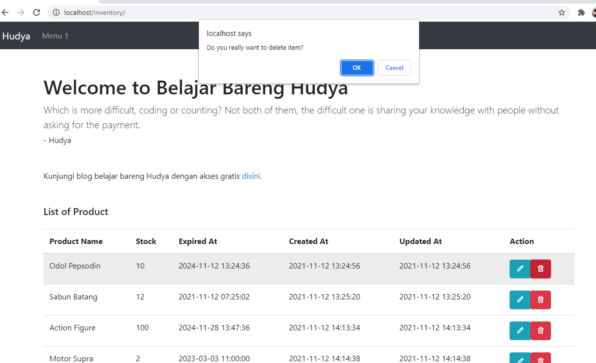

# Part 4 - Update & Delete

# Overview

Setelah mencoba create dan read data pada Database, pada materi ini kita akan mencoba untuk melakukan perubahan dan penambahan data.

# Tambahkan Fungsi

Kita perlu menambahkan fungsi untuk menampilkan data berdasarkan ID, lalu query update dan delete.

```php
        function show($id){
            $result = null;
            $query = "SELECT * FROM inventory WHERE id = ?";
            $process = $this->database->connection->prepare($query);
            
            if($process) {
                $process->bind_param('s', $id);
                $process->execute();

                $result = $process->get_result();
                $result = $result->fetch_assoc();
            } else {
                $error = $this->database->connection->errno . ' ' . $this->database->connection->error;
                echo $error;
            }
            
            $process->close();
            $this->database->closeConnection();            

            return $result;
        }

        function update($id, $name, $stock, $expired_at){
            $query = "UPDATE `inventory` SET `name` = ?, `stock` = ?, `expired_at` = ? WHERE id = ?";
            $process = $this->database->connection->prepare($query);

            if($process) {
                $process->bind_param('ssss', $name, $stock, $expired_at, $id);
                $process->execute();
            } else {
                $error = $this->database->connection->errno . ' ' . $this->database->connection->error;
                echo $error;
            }
            
            $process->close();
            $this->database->closeConnection();            

            return true;
        }

        function delete($id){
            $query = "UPDATE `inventory` SET `deleted_at` = CURRENT_TIMESTAMP() WHERE id = ?";

            $process = $this->database->connection->prepare($query);

            if($process) {
                $process->bind_param('s', $id);
                $process->execute();
            } else {
                $error = $this->database->connection->errno . ' ' . $this->database->connection->error;
                echo $error;
            }
            
            $process->close();
            $this->database->closeConnection();            

            return true;
        }
```

Keseluruhan filenya menjadi seperti ini:

```php
<?php
    include('connection.php');

    class Inventory {

        function __construct()
        {
            $this->database = new ConnectionDatabase();
        }

        function getAll(){
            $query = "SELECT * FROM inventory WHERE deleted_at IS NULL";
            $data = mysqli_query($this->database->connection, $query);
            
            $res = [];
    
            while($item = mysqli_fetch_array($data)) {
                $res[] = $item;
            }

            $this->database->closeConnection();
    
            return $res;
        }

        function store($name, $stock, $expired_at){
            $query = "INSERT INTO `inventory` (`name`, `stock`, `expired_at`) VALUES (?,?,?)";

            $process = $this->database->connection->prepare($query);

            if($process) {
                $process->bind_param('sss', $name, $stock, $expired_at);
                $process->execute();
            } else {
                $error = $this->database->connection->errno . ' ' . $this->database->connection->error;
                echo $error;
            }
            
            $process->close();
            $this->database->closeConnection();            

            return true;
        }

        function show($id){
            $result = null;
            $query = "SELECT * FROM inventory WHERE id = ?";
            $process = $this->database->connection->prepare($query);
            
            if($process) {
                $process->bind_param('s', $id);
                $process->execute();

                $result = $process->get_result();
                $result = $result->fetch_assoc();
            } else {
                $error = $this->database->connection->errno . ' ' . $this->database->connection->error;
                echo $error;
            }
            
            $process->close();
            $this->database->closeConnection();            

            return $result;
        }

        function update($id, $name, $stock, $expired_at){
            $query = "UPDATE `inventory` SET `name` = ?, `stock` = ?, `expired_at` = ? WHERE id = ?";

            $process = $this->database->connection->prepare($query);

            if($process) {
                $process->bind_param('ssss', $name, $stock, $expired_at, $id);
                $process->execute();
            } else {
                $error = $this->database->connection->errno . ' ' . $this->database->connection->error;
                echo $error;
            }
            
            $process->close();
            $this->database->closeConnection();            

            return true;
        }

        function delete($id){
            $query = "UPDATE `inventory` SET `deleted_at` = CURRENT_TIMESTAMP() WHERE id = ?";

            $process = $this->database->connection->prepare($query);

            if($process) {
                $process->bind_param('s', $id);
                $process->execute();
            } else {
                $error = $this->database->connection->errno . ' ' . $this->database->connection->error;
                echo $error;
            }
            
            $process->close();
            $this->database->closeConnection();            

            return true;
        }

    }
    
   
?>
```

# Ubah Controller

Kita perlu menambahkan controller untuk melakukan update dan delete, silahkan coba data berikut:

```php
else if ($action == "update") {
    $inventory->update(
        $_GET['id'],
        $_POST['name'],
        $_POST['stock'],
        $_POST['expired_at']
    );
    return header("location:../");
}
else if ($action == "delete") {
    $inventory->delete(
        $_GET['id']
    );
    return header("location:../");
}
```

Keseluruhan filenya menjadi seperti berikut:

```php
<?php

include '../database/inventory.php';

$inventory = new Inventory();

$action =  $_GET['action'];

if ($action == "store") {
    $inventory->store(
        $_POST['name'],
        $_POST['stock'],
        $_POST['expired_at']
    );
    return header("location:../");
}
else if ($action == "update") {
    $inventory->update(
        $_GET['id'],
        $_POST['name'],
        $_POST['stock'],
        $_POST['expired_at']
    );
    return header("location:../");
}
else if ($action == "delete") {
    $inventory->delete(
        $_GET['id']
    );
    return header("location:../");
}

?>
```

# Buat File Edit

Kita perlu menambahkan edit.php untuk melakukan update, silahkan buat file edit.php lalu masukkan kode di bawah ini:

```php
<!DOCTYPE html>
<html lang="en">
<head>
    <?php include('header.php') ?>
</head>

<body>
    <?php include('navbar.php') ?>

    <main role="main " class="container">
        
        <?php include('welcome_message.php') ?>
        
        <?php 
            include('database/inventory.php');
            $id =  $_GET['id'];

            $data = new Inventory();
            $data = $data->show($id);
        ?>

        <div class="container mt-5">
            <div class="row mb-4">
                <div class="col-12">
                    <h5 class="mb-4">Detail Product <?= $data['name'] ?></h5>
                    <form action="controller/inventory.php?id=<?= $data['id'] ?>&action=update" method="POST">
                        <div class="mb-3">
                            <label for="exampleFormControlInput1" class="form-label">Product Name</label>
                            <input type="text" class="form-control" id="exampleFormControlInput1" placeholder="Input product name" name="name" value="<?= $data['name'] ?>">
                        </div>
                        <div class="mb-3">
                            <label for="exampleFormControlInput1" class="form-label">Stock</label>
                            <input type="number" class="form-control" id="exampleFormControlInput1" placeholder="Input product stock" name="stock" value="<?= $data['stock'] ?>"">
                        </div>
                        <div class="mb-3">
                            <label for="exampleFormControlInput1" class="form-label">Expired at</label>
                            <input type="text" class="form-control" id="exampleFormControlInput1" placeholder="Input product expired at" name="expired_at" value="<?= $data['expired_at'] ?>">
                        </div>
                        <div class="mb-3">
                            <button type="submit" class="btn btn-primary">
                                Submit
                            </button>
                        </div>
                    </form>
                </div>
            </div>
        </div>
    </main>

    <?php include('footer.php') ?>

    <?php include('scripts.php') ?>
</body>

</html>
```

# Perbarui Halaman Index

Silahkan perbarui halaman index.php pada bagian table:

```php
<table class="table table-hover ">
  <thead>
    <tr>
      <th scope="col ">Product Name</th>
      <th scope="col ">Stock</th>
      <th scope="col ">Expired At</th>
      <th scope="col ">Created At</th>
      <th scope="col ">Updated At</th>
      <th scope="col ">Action</th>
    </tr>
  </thead>
  <tbody> <?php foreach($data->getAll() as $item) { ?> <tr>
      <td> <?= $item['name'] ?> </td>
      <td> <?= $item['stock'] ?> </td>
      <td> <?= $item['expired_at'] ?> </td>
      <td> <?= $item['created_at'] ?> </td>
      <td> <?= $item['updated_at'] ?> </td>
      <td>
        <div class="btn-group " role="group " aria-label="Basic example ">
          <a href="edit.php?id=<?= $item['id'] ?>" class="btn btn-info text-white ">
            <i class="bx bx-pencil"></i>
          </a>
          <form onsubmit="return confirm('Do you really want to delete item?')" 
							action="controller/inventory.php?id=<?= $item['id'] ?>&action=delete" 
							method="POST">
            <button type="submit" class="btn btn-danger text-white">
              <i class="bx bx-trash"></i>
            </button>
          </form>
        </div>
      </td>
    </tr> <?php } ?> </tbody>
</table>
```

Voila, kita selesai menambahkan halaman update dan delete.

## Proses Edit Data


## Proses Hapus Data



