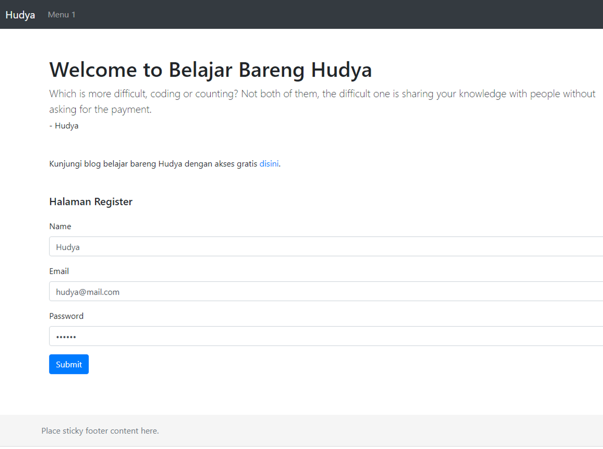
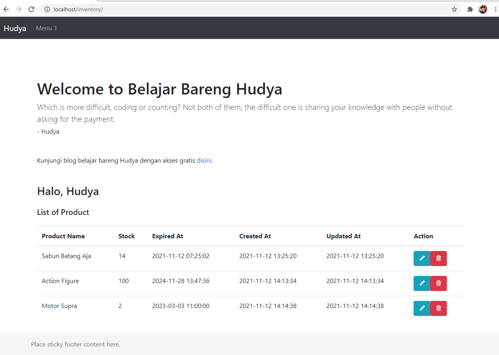

# Part 7 — Menampilkan Data Pada Select

# Overview

Setelah berhasil melakukan perubahan data, saatnya kita belajar untuk membuat login dan menggunakan fitur session.

# Buat Tabel User

Pertama kita memerlukan tabel user dengan query berikut:

```sql
CREATE TABLE `users` (
  `id` int(11) NOT NULL PRIMARY KEY AUTO_INCREMENT,
  `name` varchar(230) NOT NULL,
  `email` varchar(230) NOT NULL,
  `password` text NOT NULL,
  `created_at` timestamp NOT NULL DEFAULT current_timestamp(),
  `updated_at` timestamp NOT NULL DEFAULT current_timestamp(),
  `deleted_at` timestamp NULL DEFAULT NULL
);

ALTER TABLE `users` ADD UNIQUE KEY `email` (`email`);
```

# Buat file Auth pada folder Database

Kita memerlukan file bernama `auth.php` yang akan gerbang koneksi ke database, buatlah file `auth.php` pada folder database lalu masukkan code berikut:

```php
<?php
    include('connection.php');

    class Auth {

        function __construct()
        {
            $this->database = new ConnectionDatabase();
        }

        function register($name, $email, $password){
            $query = "INSERT INTO `users` (`name`, `email`, `password`) VALUES (?,?,?)";

            $process = $this->database->connection->prepare($query);

            if($process) {
                $process->bind_param('sss', $name, $email, md5($password));
                $process->execute();
            } else {
                $error = $this->database->connection->errno . ' ' . $this->database->connection->error;
                echo $error;
            }
            
            $process->close();
            $this->database->closeConnection();            

            return true;
        }

        function login($email, $password){
            $result = null;
            $query = "SELECT * FROM `users` WHERE email = ?";
            $process = $this->database->connection->prepare($query);
            
            if($process) {
                $process->bind_param('s', $email);
                $process->execute();

                $result = $process->get_result();
                $result = $result->fetch_assoc();

                if ($result['password'] != md5($password)) {
                    return false;
                }
                
            } else {
                $error = $this->database->connection->errno . ' ' . $this->database->connection->error;
                echo $error;
            }
            
            $process->close();
            $this->database->closeConnection();            

            return $result;
        }
    }
?>
```

Apabila kamu perhatikan syntax pada bagian insert, kita melakukan enkripsi variabel password dengan fungsi md5, dimana hasil dari password akan dibuat menjadi hash sehingga tidak bisa dipahami oleh manusia bahkan tidak bisa didekripsi.

# Buat Controller Auth

Sekarang buatlah file bernama `auth.php` pada folder controller lalu masukkan code di bawah ini:

```php
<?php
session_start();

include '../database/auth.php';

$auth = new Auth();

$action =  $_GET['action'];

if ($action == "login") {
    $result = $auth->login(
        $_POST['email'],
        $_POST['password']
    );

    if ($result) {
        $_SESSION['loggedIn'] = true;
        $_SESSION['id'] = $result['id'];
        $_SESSION['name'] = $result['name'];
        return header("location:../");
    }
    
    return header("location:../login.php");
}
else if ($action == "register") {
    $auth->register(
        $_POST['name'],
        $_POST['email'],
        $_POST['password']
    );

    return header("location:../login.php");
}

?>
```

# Buat file Login

Buatlah file `login.php` sejajar dengan `index.php` lalu masukkan code berikut:

```php
<!doctype html>
<html lang="en">
<head>
    <?php include('header.php') ?>
</head>

<body>
    <?php include('navbar.php') ?>

    <main role="main " class="container">
        
        <?php include('welcome_message.php') ?>

        <div class="container mt-5">
            <div class="row mb-4">
                <div class="col-12">
                    <h5 class="mb-4">Halaman Login</h5>
                    <form action="controller/auth.php?action=login" method="POST">
                        <div class="mb-3">
                            <label for="exampleFormControlInput1" class="form-label">Email</label>
                            <input type="email" class="form-control" id="exampleFormControlInput1" placeholder="Input your email" name="email">
                        </div>
                        <div class="mb-3">
                            <label for="exampleFormControlInput1" class="form-label">Password</label>
                            <input type="password" class="form-control" id="exampleFormControlInput1" placeholder="Input your password" name="password">
                        </div>
                        <div class="mb-3">
                            <button type="submit" class="btn btn-primary">
                                Submit
                            </button>
                        </div>
                    </form>
                </div>
            </div>
        </div>
    </main>

    <?php include('footer.php') ?>

    <?php include('scripts.php') ?>
</body>

</html>
```

# Buat File Register

Buatlah file `register.php` lalu masukkan code berikut:

```php
<!doctype html>
<html lang="en">
<head>
    <?php include('header.php') ?>
</head>

<body>
    <?php include('navbar.php') ?>

    <main role="main " class="container">
        
        <?php include('welcome_message.php') ?>

        <div class="container mt-5">
            <div class="row mb-4">
                <div class="col-12">
                    <h5 class="mb-4">Halaman Register</h5>
                    <form action="controller/auth.php?action=register" method="POST">
                        <div class="mb-3">
                            <label for="exampleFormControlInput1" class="form-label">Name</label>
                            <input type="text" class="form-control" id="exampleFormControlInput1" placeholder="Input your name" name="name">
                        </div>
                        <div class="mb-3">
                            <label for="exampleFormControlInput1" class="form-label">Email</label>
                            <input type="email" class="form-control" id="exampleFormControlInput1" placeholder="Input your email" name="email">
                        </div>
                        <div class="mb-3">
                            <label for="exampleFormControlInput1" class="form-label">Password</label>
                            <input type="password" class="form-control" id="exampleFormControlInput1" placeholder="Input your password" name="password">
                        </div>
                        <div class="mb-3">
                            <button type="submit" class="btn btn-primary">
                                Submit
                            </button>
                        </div>
                    </form>
                </div>
            </div>
        </div>
    </main>

    <?php include('footer.php') ?>

    <?php include('scripts.php') ?>
</body>

</html>
```

# Buat File Logout

Buatlah file `logout.php` yang akan menjadi akses saat kita keluar dari aplikasi, masukkan kode berikut:

```php
<?php

session_start();
unset($_SESSION['loggedIn']);
unset($_SESSION['id']);
unset($_SESSION['name']);
    
return header("location:/inventory/login.php");

?>
```

# Buat Middleware

Middleware berfungsi sebagai pencegah, yaitu file yang diakses sebelum file utamanya terakses, buatlah file bernama `middleware.php` pada folder controller lalu masukkan code berikut:

```php
<?php
session_start();

if(!isset($_SESSION['loggedIn'])) {
    return header("location:../inventory/login.php");
}

?>
```

# Ubah Index

Sekarang lakukan sedikit perubahan pada file `index.php` milikmu menjadi seperti berikut:

```php
<!doctype html>
<html lang="en">

<?php session_start(); ?>
<?php include('controller/middleware.php'); ?>

<head>
    <?php include('header.php') ?>
</head>

<body>
    <?php include('navbar.php') ?>

    <main role="main " class="container">
        
        <?php include('welcome_message.php') ?>
        
        <?php 
            include('database/inventory.php');

            $data = new Inventory();
        ?>

        <div class="container mt-5">
            <div class="row mb-4">
                <div class="col-12">
                    <h3 class="mb-4">Halo, <?= $_SESSION['name'] ?></h5>

                    <h5 class="mb-4">List of Product</h5>

                    <table class="table table-hover ">
                        <thead>
                            <tr>
                                <th scope="col ">Product Name</th>
                                <th scope="col ">Stock</th>
                                <th scope="col ">Expired At</th>
                                <th scope="col ">Created At</th>
                                <th scope="col ">Updated At</th>
                                <th scope="col ">Action</th>
                            </tr>
                        </thead>
                        <tbody>
                            <?php foreach($data->getAll() as $item) { ?>
                            <tr>
                                <td><?= $item['name'] ?></td>
                                <td><?= $item['stock'] ?></td>
                                <td><?= $item['expired_at'] ?></td>
                                <td><?= $item['created_at'] ?></td>
                                <td><?= $item['updated_at'] ?></td>
                                <td>
                                    <div class="btn-group " role="group " aria-label="Basic example ">
                                        <a href="edit.php?id=<?= $item['id'] ?>" class="btn btn-info text-white ">
                                            <i class="bx bx-pencil"></i>
                                        </a>
                                        <form onsubmit="return confirm('Do you really want to delete item?')" action="controller/inventory.php?id=<?= $item['id'] ?>&action=delete" method="POST">
                                            <button type="submit" class="btn btn-danger text-white">
                                                <i class="bx bx-trash"></i>
                                            </button>
                                        </form>
                                    </div>
                                </td>
                            </tr>
                            <?php } ?>
                        </tbody>
                    </table>
                </div>
            </div>
        </div>
    </main>

    <?php include('footer.php') ?>

    <?php include('scripts.php') ?>
</body>

</html>
```

Sekarang cobalah akses halaman localhost/inventory, kamu akan dilempar kepada halaman login.php.

Pergilah ke [localhost/inventory/register.php](http://localhost/inventory/register.php) lalu buatlah akun baru




Sekarang pergilah ke [localhost/inventory/logout.php](http://localhost/inventory/logout.php) lalu cobalah untuk akses kembali ke localhost/inventory. Apabila kamu mengikuti materi ini dengan benar kamu akan diarahkan kembali ke halaman login.

Voila, kita sudah berhasil menerapkan login & session sederhana pada PHP Native.

# Tugas Latihan

Dengan menggunakan session, kerjakanlah latihan berikut:

1. Tambahkan kolom user_id pada tabel inventories dimana kolom ini berelasi dengan kolom id pada tabel users.
2. Buatlah agar semua barang yang tampil pada halaman index.php sesuai dengan session ID dari user yang sedang login.
3. Ketika user menambahkan barang, maka kolom user_id pada tabel inventory otomatis terisi dengan session ID dari user yang sedang login.
