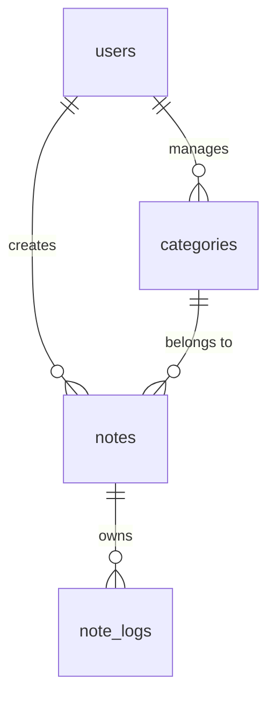

 

by [@perogeremmer](https://twitter.com/perogeremmer)

**Table of contents**

- [Belajar bikin database Notes](#belajar-bikin-database-notes)
- [Pertama → bikin tabel users](#pertama--bikin-tabel-users)
- [Kedua → bikin tabel categories](#kedua--bikin-tabel-categories)
- [Ketiga → bikin tabel notes](#ketiga--bikin-tabel-notes)
- [Terakhir → bikin tabel note\_logs](#terakhir--bikin-tabel-note_logs)
- [Hasil ERD](#hasil-erd)

## Belajar bikin database Notes

Kita akan belajar bikin database notes. Tentunya susunan database ini akan melibatkan autentikasi supaya kamu bisa paham bagaimana relasi antar table.

Semua penjelasan udah saya jelasin ya di bagian deskripsi tabel, kalian bisa baca 😆

## Pertama → bikin tabel users

Kita bakalan bikin tabel users yang menyimpan informasi pengguna kita.

|columns|type|key|default value|description|
|-|-|-|-|-|
|id|integer|auto increment, primary||kolom ID pake increment supaya cepet kalo butuh ordering|
|name|varchar(250)|not null||Kolom nama users, kita bikin not null karena nama mah emang harus diisi atuh?|
|email|varchar(250)|index, not null||Kolom email dari users, kita buat index biar cepet pencariannya|
|password|text|not null||Kolom password kita buat text biar nyimpen nilai panjang, misalnya pake enkripsi yang hasilnya panjang, yaudah kita bikin panjang aja sekalian|
|confirmed_at|datetime|||Kolom ini dipake untuk nandain user tersebut udah konfirmasi apa belom di email, example value: 2023-04-02 13:15:34|
|created_at|datetime||current timestamp|Kolom ini untuk nandain kapan akun dibuat, pake current timestamp aja|
|updated_at|datetime||current timestamp|Setiap ada perubahan pada akun, misalnya ganti nama, nah silahkan update juga kolom ini|

## Kedua → bikin tabel categories

Kita bikin tabel categories untuk ngebuat notes berdasarkan kategori yang dibuat sama user tersebut.

|columns|type|key|default value|description|
|-|-|-|-|-|
|id|integer|auto increment, primary||kolom ID pake increment supaya cepet kalo butuh ordering|
|name|varchar(150)|not null||Kolom nama kategori|
|description|varchar(250)|nullable||Kolom deskripsi datei kategori tersebut, gak usah dibikin panjang-panjang, jadi 250 karakter aja cukup|
|user_id|integer|foreign key||Kolom ini dipakai untuk masukin id user ke bagian kategori, biar ketauan ini kategori punya siapa|
|status|char(1)|index||Kolom ini dipake buat bikin status dari kategori, mungkin ada yang nggak pengen ditampilin (di-archive), nah bisa dibikin status, misalnya A (Archived), Y (Active)|
|created_at|datetime||current timestamp|Kolom ini untuk nandain kapan akun dibuat, pake current timestamp aja|
|updated_at|datetime||current timestamp|Setiap ada perubahan pada akun, misalnya ganti nama, nah silahkan update juga kolom ini|
|deleted_at|datetime|||Setiap kategori dihapus, isi kolom ini pake date time, tujuannya biar soft delete|

## Ketiga → bikin tabel notes

Kita bikin tabel notes sebagai tabel utamanya.

|columns|type|key|default value|description|
|-|-|-|-|-|
|id|integer|auto increment, primary||kolom ID pake increment supaya cepet kalo butuh ordering|
|title|varchar(150)|not null||Kolom nama notes|
|notes|text|not null||Isi dari notesnya, kita bikin teks supaya bisa nyimpen panjang banget. Kalo mau notes berbentuk markdown bisa pake JSON.|
|user_id|integer|foreign key||Kolom ini dipakai untuk masukin id user ke bagian kategori, biar ketauan ini kategori punya siapa|
|category_id|integer|foreign key||Kolom ini dipakai untuk masukin id user, biar ketauan ini kategori apa|
|status|char(1)|index||Kolom ini dipake buat bikin status dari kategori, mungkin ada yang nggak pengen ditampilin (di-archive), nah bisa dibikin status, misalnya A (Archived), Y (Active)|
|created_at|datetime||current timestamp|Kolom ini untuk nandain kapan akun dibuat, pake current timestamp aja|
|updated_at|datetime||current timestamp|Setiap ada perubahan pada akun, misalnya ganti nama, nah silahkan update juga kolom ini|
|deleted_at|datetime|||Setiap kategori dihapus, isi kolom ini pake date time, tujuannya biar soft delete|

## Terakhir → bikin tabel note_logs

Kita bikin tabel note_logs buat bikin history terhadap note yang diubah.

|columns|type|key|default value|description|
|-|-|-|-|-|
|id|integer|auto increment, primary||kolom ID pake increment supaya cepet kalo butuh ordering|
|note_id|integer|foreign key||Kolom ini dipakai untuk nandain id dari notesnya|
|type|varchar(20)|index||Kolom ini buat dipake dari log notes, misalnya type CHANGED artinya perubahan notes, DELETED artinya penghapusan notes|
|metadata|json|||Kolom ini dipake buat nyimpen data selain data di atas, biar fleksibel, kita pake JSON aja|
|created_at|datetime||current timestamp|Kolom ini untuk nandain kapan akun dibuat, pake current timestamp aja|

## Hasil ERD

Berikut adalah hasil ERD-nya:

ERD Database Notes

- table users memiliki relasi 1 to many ke notes, hal ini karena satu users dapat memiliki banyak notes, tapi setiap notes hanya dimiliki oleh satu users.
- table users memiliki relasi 1 to many ke categories, hal ini karena satu users dapat memiliki banyak categories, tapi setiap categories hanya dimiliki oleh satu users.
- table categories memiliki relasi 1 to many ke notes, hal ini karena satu categories dapat memiliki banyak notes, tapi setiap notes hanya dimiliki oleh satu category.
- table notes memiliki relasi 1 to many ke note_logs, hal ini karena satu notes dapat memiliki banyak logs, tapi setiap logs hanya dimiliki oleh satu notes.

Jadi gimana nih? Gak susah kan buat bikin database sederhana? Anyway ini masih bisa dikembangin loh guys jadi punya workspace, terus ada member team di tiap workspace, siapa yang punya akses ke notes.

Hal simple sebenernya bisa dibuat ribet, jikalau mau 😆
