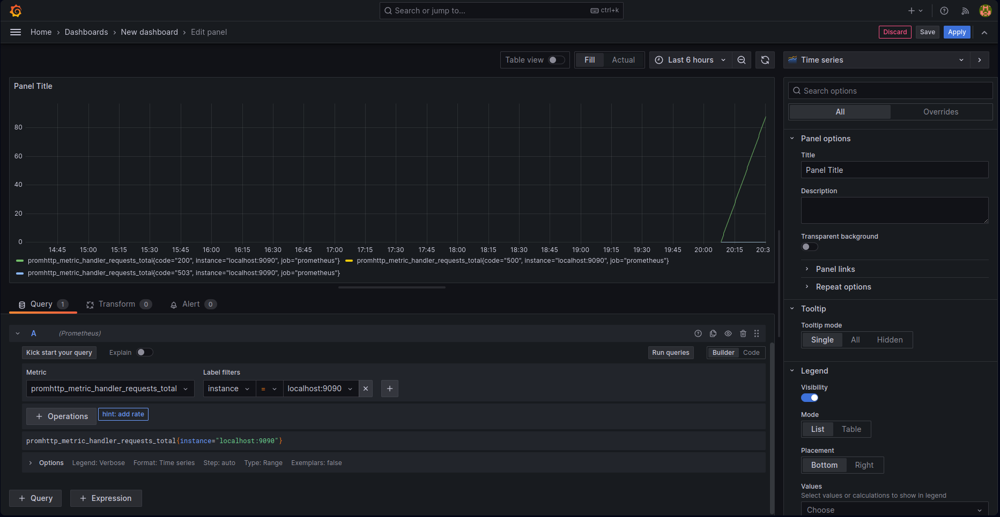

<br/>

by [@perogeremmer](https://twitter.com/perogeremmer)

## Belajar dan Install Grafana (Local)

Sebelum kamu lanjut untuk membaca ini, saya mau bilang bahwa tutorial ini bukan untuk **pemula**.

Sekali lagi, tutorial ini bukan untuk **pemula**.

Tutorial ini kurang lebih mirip dengan [Belajar dan install Percona](./belajar-dan-install-percona.md), tapi versi [Grafana](https://grafana.com).

Untuk memahami ini, paling nggak kamu udah harus terbiasa dengan hal-hal berikut:

- Docker
- Command Line (Linux khususnya)
- Sedikit pemahaman server
- Pemahaman HTTP / HTTPS
- Instalasi DB (MySQL)
- MySQL syntax admin (grant, create user)

Maka kalau kamu belum paham tapi tetep pengen maksa supaya baca, resiko anda tanggung sendiri hehehe.

## Grafana tuh apa?

Grafana tuh software atau tools **open source** yang memungkinkan kita untuk melakukan **monitoring** dalam bentuk visualisasi. Nah kelebihan Grafana ini adalah, mereka itu udah well-connected dengan tools-tools external seperti [Prometheus](https://prometheus.io).

> Bedanya sama Percona apa bang?

Bedanya, ini lebih fleksibel. Fleksibel sama tools yang pengen di-sinkron, termasuk juga dengan dashboard yang pengen ditampilin. Tbh, sebenernya Percona juga lebih fleksibel karena Percona ini memanfaatkan Grafana sebagai dashboard yang digabung dengan agent dari Percona itu sendiri. Jadi bisa dibilang Grafana ini versi mandiri-nya dari Percona.

Kenapa dibilang mandiri?

Soalnya Grafana itu sendiri gak bisa monitoring sebenernya, tapi bisa memvisualisasikan, makanya Grafana itu tools untuk nampilin, sedangkan Percona itu paket komplitnya. Jadi untuk membuat Grafana lebih optimal, kita perlu tools lain seperti Prometheus yang tadi saya sebut.


Bisa dilihat dari gambar berikut adalah contoh bagian dashboard, mirip Percona kan? Eh salah, yang ada juga Percona yang mirip Grafana 🤣.

---

Mungkin kalo cuma ngomongin teori bakalan bingung ya, jadi pada intinya, di tutorial kali ini kita bakalan nyobain install Grafana pada server beneran. Untuk kali ini gue gak akan pake server local, tapi pake server beneran.

> Bang kalo mau install di local boleh?

Boleh banget lah, cuma gue sih biar gampang aja makanya gue pengen install di server gue langsung. Lagian gue males bersih-bersihin filenya kalo di local gue hehehe, tapi kalo kalian emang gak ada doku alias duit, yaudah gapapa install aja di local kalian.

> Ohiya bang yang terpenting, gratis gak sih? hehehe

Absolutely, karena ini `open source` maka biaya toolsnya gratis. Tapi tetep ya, kalian harus **bayar server** kalian, masa udah toolsnya gratis, servernya juga mau gratis???? Kurang ajar banget klean ini.

## Arsitektur

Sebelum kita lanjut untuk install, kita pahami dulu arsitektur yang akan kita bangun.


Jadi akan ada tiga aplikasi yang kita install:

1. Grafana Agent (Beserta Client) → Software untuk nampilin data visualisasi
2. Prometheus → Software untuk collect data time series
3. Database MySQL 8.0 → Tempat nyimpen data, apalagi coba?

## It's Time to Start

Yep udah saatnya kita mulai install.

Pertama, grafana itu support beberapa OS Server:

- Debian / Ubuntu
- Red Hat, RHEL, or Fedora
- SUSE or openSUSE
- macOS
- Windows

Paling enggak, server kita harus memiliki:

- Minimum recommended memory: 255 MB
- Minimum recommended CPU: 1

Kecil ya? Ya iyalah, kan cuma buat monitoring, yang bikin beda antara grafana dan Percona adalah Grafana itu tugasnya cuma nampilin sedangkan Percona itu merupakan tools agent yang ngumpulin data itu sendiri.

Disini gue akan pake requirement server kaya gini:

- Ubuntu 20.04 LTS
- CPU 1
- RAM 2GB
- 60GB Disk

Nah untuk provider cloudnya gue pake .....

Ah berhubung kaga ada yang kerjasama sama gue, ya gue gak spill cloudnya pake apa xixixi. Ditunggu ya buat para provider cloud kalo mau kerjasama 🤣.

Pertama, install dulu MySQL 8.0.

```bash
sudo apt install mysql-server

sudo systemctl start mysql.service
```

Kedua, pastikan kalian sudah bisa masuk ke database kalian.

```plain
ubuntu@ip-172-26-13-205:~$ mysql -u root -p
Enter password: 
Welcome to the MySQL monitor.  Commands end with ; or \g.
Your MySQL connection id is 18
Server version: 8.0.33-0ubuntu0.20.04.2 (Ubuntu)

Copyright (c) 2000, 2023, Oracle and/or its affiliates.

Oracle is a registered trademark of Oracle Corporation and/or its
affiliates. Other names may be trademarks of their respective
owners.

Type 'help;' or '\h' for help. Type '\c' to clear the current input statement.

mysql> 
```

Ketiga, install docker kalo belom ada.

```bash
sudo apt install docker.io
sudo apt install docker-compose
```

Keempat, install nginx jangan lupa.

```bash
sudo apt install nginx
```

Biar docker gak ribet pake sudo-sudo, kita tambahin dulu nih ke sudo group

```bash
sudo usermod -aG docker $USER
```

Coba jalanin docker di CLI kalian dengan mengetikkan `docker info`, kalo kalian masih liat isu permission, kita bisa pake cara yang lebih sakti:

```bash
sudo chown root:docker /var/run/docker.sock
sudo chmod 660 /var/run/docker.sock
```

Kalo masih belom bisa restart service dockernya, kalo belom bisa juga restart pc/server kalian.

## Preparing Grafana

Karena kita akan pake docker-compose, maka dari itu kita bakalan bikin folder baru, kalo gue namain `grafana-agent`.

```bash
mkdir grafana-agent
```

Masuk ke folder `grafana-agent`, kemudian kita buat settingan dari prometheusnya, buat file baru bernama `prometheus.yml` dan berikut isi filenya:

```yaml
global:
  scrape_interval: 15s
  evaluation_interval: 15s

scrape_configs:
  - job_name: 'prometheus'
    static_configs:
      - targets: ['localhost:9090']

  - job_name: 'grafana'
    static_configs:
      - targets: ['localhost:3000']
```

Kemudian kita buat file baru bernama `docker-compose.yaml` sebagai config composenya, lalu masukkan kode berikut:

```yaml
version: '3'
services:
  prometheus:
    image: prom/prometheus
    ports:
      - 9090:9090
    volumes:
      - ./prometheus.yml:/etc/prometheus/prometheus.yml
  grafana:
    image: grafana/grafana
    ports:
      - 3000:3000
    volumes:
      - grafana-data:/var/lib/grafana
    environment:
      GF_SECURITY_ADMIN_PASSWORD: secret
      GF_USERS_ALLOW_SIGN_UP: 'false'
volumes:
  grafana-data:
```

Terakhir, kita jalankan pake `docker-compose up -d` di dalam folder `grafana-agent`, tunggu proses download dockernya sampe begini:

```plain
Creating network "grafana-agent_default" with the default driver
Creating grafana-agent_grafana_1    ... done
Creating grafana-agent_prometheus_1 ... done
```

Sekarang kita perlu ubah sedikit settingan nginx kita (bagi yang pake server, pastiin IP server kalian proxy_passnya diarahkan ke port 3000, port si grafana client). Bagi yang ngelakuinnya di lokal, tinggal akses aja `localhost:3000`.

Segera login dengan username `admin`, passwordnya `secret`.

## Connect with MySQL

Nah kemudian kita perlu masukin data source, data source ini adalah sumber data yang bisa diakses sama si grafana. Pergi ke menu → Connections → Add new connection → pilih MySQL.


Kemudian isi host kalian dengan `localhost` kalo jalanin di local, nah kalo jalanin di server, sayangnya kita perlu akses dengan port public (tbh saya belom nemu caranya lewat private IP), tapi karena buat belajar gapapa lah ya hehehe.

Jangan lupa disesuaikan username dan passwordnya, pastiin juga akun kalian untuk akses DB itu boleh diakses secara [remote](https://www.digitalocean.com/community/tutorials/how-to-allow-remote-access-to-mysql).

Jangan lupa juga kalian harus edit database config kalian pada `/etc/mysql/mysql.conf.d/mysqld.cnf` dan ganti pada bagian ini:

```plain
bind-address            = 127.0.0.1
```

menjadi seperti ini:

```plain
bind-address            = 0.0.0.0
```

Artinya, MySQL akan mengikuti IP dari Servernya.

Terakhir, restart service MySQL-nya: `sudo systemctl restart mysql`.


Nah ini tampilan kalo berhasil koneksi ke DB kita.

## Connect to Prometheus

Nah kemudian kita perlu masukin data source prometheus. Pergi ke menu → Connections → Add new connection → pilih Prometheus.


Sama juga kaya MySQL, kalo berhasil ada ijo-ijonya pas save & test.

## Create new Dashboard


Sekarang pergi ke dashboard dan klik New → New Dashboard


Lalu pilih Prometheus hingga muncul seperti ini:


Kita setting agar menjadi seperti ini:



Tampilan ini menunjukan berapa request HTTP untuk instance prometheus yang kita install. Kalau udah klik run queries biar keliatan hasilnya.

Ohiya ini cuma contoh aja ya, jujur sebenernya lebih kompleks dari ini ges 😭.
Kalo udah klik apply pada pojok kanan atas.


Nah ini tampilan hasil akhirnya nanti, kita bisa save dengan tekan `CTRL + S`.


Langsung klik save aja ges biar gak ribet hehehe, nanti eksplor sendiri aja edit-editnya.

## Show Data from MySQL

Kita bisa aja nampilin data dari MySQL, tujuannya adalah memberikan visibility kepada tim yang gak punya akses ke DB, karena biasanya yang punya itu level lead atau level DevOps.

Masuk ke DB kita lalu buat database baru namanya `belajar`.

Buat table baru pake query ini:

```sql
CREATE TABLE users (
    id INT AUTO_INCREMENT PRIMARY KEY,
    email VARCHAR(230) UNIQUE,
    name VARCHAR(230),
    created_at TIMESTAMP DEFAULT CURRENT_TIMESTAMP,
    updated_at TIMESTAMP DEFAULT CURRENT_TIMESTAMP ON UPDATE CURRENT_TIMESTAMP
);
```

Terus kita simulasikan ada 1000 data di table users, masukkin query ini:
```sql
-- Generate 1000 random records for the users table
INSERT INTO users (email, name)
SELECT
    CONCAT('user', LPAD(ROW_NUMBER() OVER (ORDER BY (SELECT NULL)), 4, '0'), '@example.com'),
    CONCAT('User', LPAD(ROW_NUMBER() OVER (ORDER BY (SELECT NULL)), 4, '0'))
FROM
    information_schema.columns;

-- Update created_at and updated_at with random timestamps
UPDATE users
SET created_at = TIMESTAMPADD(MINUTE, -FLOOR(RAND() * 10080), CURRENT_TIMESTAMP),
    updated_at = TIMESTAMPADD(MINUTE, -FLOOR(RAND() * 10080), CURRENT_TIMESTAMP);
```

Masih di dashboard, cari menu Add (warna biru) di bagian sebelah tengah agak kekanan yang mepet sama (6 hour ago), lalu pilih visualization.


Pilih MySQL, klik bagian code dan masukan query berikut:

```sql
SELECT name, email, created_at FROM belajar.users ORDER BY id DESC LIMIT 30 
```

Lalu klik run query, maka akan muncul seperti ini:


Kalo udah klik apply, dan dashboard kalian akan muncul seperti ini:


Ketik `CTRL + S` dan klik save.

Ohiya kalian bisa juga atur agar grafana selalu nge-trigger visualisasi based on command yang kalian tulis dalam rentang waktu sesuai yang kalian minta, disini gue minta setiap 5 detik ngupdate.


Overall gitu aja dulu untuk basic install Grafana, next gue bakalan tunjukin gimana caranya pake Grafana versi Cloud yang dari webnya langsung 😃.
